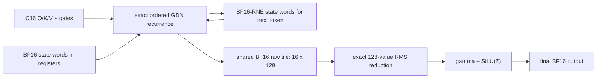

# Exact Prefill GDN dataflow on SM87

Status: the original P0 exact composite is implemented at commit `4c135d5` as
an isolated test-only CUDA cell, passed T1 synthetic correctness/resource
gates, and passed the P513/C512 complete-GDN-state correctness gate at
`6e668f5`. Its CTA-serial sixteen-row epilogue was rejected by the first
snapshot-free real-model direction screen at 0.997493235x. A bounded
NSys/NCU diagnosis then identified sixteen serial 256-thread reduction trees
as the loss. Commit `fc597e9` replaces that epilogue with two eight-row warp
batches while preserving the exact reduction order. The revised candidate is
retained as the test-only native experimental incumbent after all six real
P513 rounds passed: Prefix falls from 2556.550133 to 2529.929521 ms
(1.010522274x), and TTFT falls from 2665.298000 to 2638.661993 ms
(1.010094513x). Commit `912897b` then passes the P257/P513/P769/P1025
direction and complete-state matrix, including C256 and a second tile at
nonzero first position. The 1.03x production margin is still not cleared, so
production dispatch remains unchanged while the next exact mechanism is
stacked on this test-only incumbent.
FlashLinearAttention and Mamba are architecture references only. No source,
generated code, binary, package, or runtime dependency from either project is
copied or introduced.

This plan is subordinate to the
[real-model performance evidence policy](REAL_MODEL_PERFORMANCE_POLICY.md).
Synthetic tensors may prove exhaustive semantics, invalid-call behavior, and
resource safety; they have no performance-retention or production-promotion
authority.

## Current contract and measured boundary

The production Prefill recurrence processes C16 at a time. One 256-thread CTA
owns one of 48 value heads and keeps its 128x128 recurrent state in packed BF16
register words across the 16 ordered tokens. Each state item is converted to
BF16 round-to-nearest-even after every token before the next recurrence step.
That per-token rounding is part of the current exact contract even when the
rounded word remains in a register rather than being written to global memory.

At P513/C512, the current profile attributes 1,536 C16 recurrence launches and
488.585408 ms to GDN across 48 linear-attention layers. The post-GDN
plain-RMSNorm plus SiLU(Z) epilogue is already internally fused, but remains a
separate 48-launch boundary after each layer's complete C512 recurrence.

Two prior experiments establish the guardrails:

- Extending the exact register-state body over the whole C256/C512 span is
  bitwise correct on its synthetic fixture but reached only
  1.02672x/1.01871x against the then-frozen 1.03x production gate. That result
  rejected production promotion; under the current evidence policy it has no
  real-trajectory retention authority and is not a permanent rejection of a
  persistent exact composite.
- Keeping FP32 state across each B8 block reaches 2.76977x/2.78551x in the
  micro screen, but changes seven state-rounding boundaries per block. On the
  real P513 checkpoint path its recurrent-state NRMSE is 0.115284 against the
  0.01 gate. Changing chunk size does not repair that semantic mismatch.

## What FlashLinearAttention actually does

This audit pins FlashLinearAttention revision
[`9c8e42e`](https://github.com/fla-org/flash-linear-attention/commit/9c8e42e762fce087c27b673af4922795d9edb85e)
and the [Gated Delta Networks paper](https://arxiv.org/abs/2412.06464).
Its chunked GDN path is a hierarchy rather than one monolithic kernel:

1. transform the forget gate and compute a chunk-local cumulative decay;
2. form the intra-chunk WY representation from KKT and a lower-triangular
   solve;
3. propagate one boundary state sequentially across chunks; and
4. reconstruct token outputs in parallel from the boundary state and
   intra-chunk terms.

The pinned implementation and API are visible in
[`chunk.py`](https://github.com/fla-org/flash-linear-attention/blob/9c8e42e762fce087c27b673af4922795d9edb85e/fla/ops/gated_delta_rule/chunk.py#L33-L123)
and its
[chunk-size dispatch](https://github.com/fla-org/flash-linear-attention/blob/9c8e42e762fce087c27b673af4922795d9edb85e/fla/ops/gated_delta_rule/chunk.py#L395-L588).
Chunk 64 fuses KKT and the solve, while chunk 16/32 separates them in
[`chunk_fwd.py`](https://github.com/fla-org/flash-linear-attention/blob/9c8e42e762fce087c27b673af4922795d9edb85e/fla/ops/gated_delta_rule/chunk_fwd.py#L331-L416).
That implementation explicitly selects a
[TF32 solve on SM80 and newer](https://github.com/fla-org/flash-linear-attention/blob/9c8e42e762fce087c27b673af4922795d9edb85e/fla/ops/gated_delta_rule/chunk_fwd.py#L18-L23),
which is outside this project's bitwise contract.
The cross-chunk state kernel keeps an FP32 state tile live while walking chunk
boundaries and supports a V-first state layout compatible with this project's
logical state orientation; see
[`chunk_delta_h.py`](https://github.com/fla-org/flash-linear-attention/blob/9c8e42e762fce087c27b673af4922795d9edb85e/fla/ops/common/chunk_delta_h.py#L50-L338).
Output reconstruction uses FP32 accumulation and a three-stage tiled path in
[`chunk_o.py`](https://github.com/fla-org/flash-linear-attention/blob/9c8e42e762fce087c27b673af4922795d9edb85e/fla/ops/common/chunk_o.py#L33-L140).

The short-sequence
[`fused_recurrent`](https://github.com/fla-org/flash-linear-attention/blob/9c8e42e762fce087c27b673af4922795d9edb85e/fla/ops/gated_delta_rule/fused_recurrent.py#L30-L179)
path does fuse Q/K L2 normalization, gates, update, and output while retaining
FP32 state, but the layer selects it only for short inference sequences. FLA's
model path requests gate and beta-sigmoid calculation
[inside the GDN kernel](https://github.com/fla-org/flash-linear-attention/blob/9c8e42e762fce087c27b673af4922795d9edb85e/fla/layers/gated_deltanet.py#L309-L345),
not through an extra global precompute boundary. Its post-GDN RMSNorm plus gate
remains a separate fused epilogue, called after recurrence
[returns](https://github.com/fla-org/flash-linear-attention/blob/9c8e42e762fce087c27b673af4922795d9edb85e/fla/layers/gated_deltanet.py#L357-L361);
its D<=512
program handles 16/32/64 rows per program in
[`fused_norm_gate.py`](https://github.com/fla-org/flash-linear-attention/blob/9c8e42e762fce087c27b673af4922795d9edb85e/fla/modules/fused_norm_gate.py#L450-L532).

Transferable ideas are the state hierarchy, fixed chunk classes, locally fused
gate calculation, and tiled multi-row epilogue. This project already uses the
compatible V-first `[value row][key]` state layout with K contiguous, so that
is a confirmed property rather than a new mechanism. Precomputing alpha/beta
into global memory would add a launch and traffic and is not implied by the
reference. The FP32 boundary state, WY composition, TF32-enabled chunk solve,
and framework integration are not eligible for the current exact path.

## What Mamba selective scan contributes

This audit pins Mamba revision
[`e9594ce`](https://github.com/state-spaces/mamba/commit/e9594ce1c732d97440f0332fdc43170a2294dbfa)
and the [Mamba paper](https://arxiv.org/abs/2312.00752). The original selective
scan represents a diagonal recurrence by an
[associative pair `(a,b)`](https://github.com/state-spaces/mamba/blob/e9594ce1c732d97440f0332fdc43170a2294dbfa/csrc/selective_scan/selective_scan_common.h#L138-L173)
and uses CUB BlockScan for an inclusive scan. Its
[load/store/scan traits](https://github.com/state-spaces/mamba/blob/e9594ce1c732d97440f0332fdc43170a2294dbfa/csrc/selective_scan/selective_scan_fwd_kernel.cuh#L24-L70)
reuse the same shared storage at different phases, and its C512 specialization
selects
[32 threads x 16 items](https://github.com/state-spaces/mamba/blob/e9594ce1c732d97440f0332fdc43170a2294dbfa/csrc/selective_scan/selective_scan_fwd_kernel.cuh#L350-L364).
The kernel folds dt bias, softplus, residual D, and an optional SiLU gate into
the scan path, but writes raw output before the gated output and does not
contain RMSNorm; the write sequence is visible in
[`selective_scan_fwd_kernel.cuh`](https://github.com/state-spaces/mamba/blob/e9594ce1c732d97440f0332fdc43170a2294dbfa/csrc/selective_scan/selective_scan_fwd_kernel.cuh#L274-L303).
Mamba's RMSNorm-plus-gate is a
[separate one-pass kernel](https://github.com/state-spaces/mamba/blob/e9594ce1c732d97440f0332fdc43170a2294dbfa/mamba_ssm/ops/triton/layernorm_gated.py#L45-L147).
Its BF16 input specialization also retains
[FP32 state/weight accumulation](https://github.com/state-spaces/mamba/blob/e9594ce1c732d97440f0332fdc43170a2294dbfa/csrc/selective_scan/selective_scan_fwd_bf16.cu#L7-L10);
BF16 input does not mean a per-token BF16 recurrent-state boundary.

GDN cannot use that `float2` scan directly. Its transition contains a 128x128
generalized Householder term, and the current BF16 rounding after each token is
nonlinear. WY is the corresponding algebraic tool only when the state
precision contract permits associative chunk composition.

Mamba-2's [SSD paper](https://arxiv.org/abs/2405.21060) supplies a closer
hierarchy: parallel chunk-state GEMMs, a short sequential state pass across
chunks, and parallel output reconstruction. The official orchestration is in
[`ssd_combined.py`](https://github.com/state-spaces/mamba/blob/e9594ce1c732d97440f0332fdc43170a2294dbfa/mamba_ssm/ops/triton/ssd_combined.py#L343-L394),
with the small state loop in
[`ssd_state_passing.py`](https://github.com/state-spaces/mamba/blob/e9594ce1c732d97440f0332fdc43170a2294dbfa/mamba_ssm/ops/triton/ssd_state_passing.py#L30-L87).
That decomposition is useful for a future numerical-contract research line,
not for bypassing today's per-token BF16 boundary.

## P0 exact composite: C16 recurrence plus post epilogue

The implemented test-only cell keeps the exact C16 recurrence and changes only
where its already-rounded raw output lives before plain-RMSNorm and SiLU(Z):

One CTA still owns one value head. After each token's FP32 state update and
raw output are complete, the raw result is encoded to BF16 exactly as today
and placed in a padded `uint16_t raw_output[16][129]` tile. The tile costs
4,128 bytes. The first implementation then processed the 16 token rows
serially with sixteen CTA-wide 256-thread reduction trees. The retained
revision assigns one row to each warp and covers C16 in two eight-warp
batches. Each lane forms `(i,i+64)` and `(i+32,i+96)`, combines those pairs,
and then applies shuffle strides 16/8/4/2/1, preserving the standalone
epilogue's FP32 addition order before `rsqrtf`, gamma, SiLU, and BF16-RNE.
The recurrence state remains rounded after every token; only the raw-output
global write/read boundary and the redundant CTA-wide synchronization are
removed.

The production exact body reports 64 registers, 34,056 static shared bytes,
zero local bytes, and four CTAs/SM. The T1 compiler and device query now report
64 registers, 38,184 static shared bytes, zero local bytes, and four CTAs/SM
for the shared-boundary candidate. It therefore clears the first resource gate
of zero local bytes and at least three active CTAs/SM while retaining the
four-CTA target.

Two controls separate the sources of improvement:

- `global-boundary composite`: fuse the launch boundary but preserve a BF16
  global store, block synchronization, and reload inside the candidate;
- `shared-boundary composite`: use the padded shared BF16 tile and remove the
  raw global round trip.

The second cell can remove 576 MiB of logical raw-output write-plus-read over
P513 and 48 separate epilogue launches. It does not remove the 1,536 C16
recurrence launches and therefore cannot by itself deliver the FP32-WY
micro-kernel's 2.8x result.

The recurrence-plus-exact-RMSNorm/SiLU shared-BF16 boundary is this project's
own composition. Neither pinned reference implements that three-part fusion,
so their performance results cannot be used as evidence that this candidate
will win.

The historical one-shot P513 Nsys attribution gives a planning boundary, not
a retention result: 1,536 exact-C16 GDN calls take 488.585408 ms and 48
standalone epilogues take 32.770496 ms, for 521.355904 ms or 339.424417 us per
C16 cell after spreading the epilogue cost. A composite breaks even below
339.424417 us/cell and clears a 1.03x chain gate at or below 329.538269
us/cell. The 576 MiB figure is logical write-plus-read volume, not measured
DRAM or L2 traffic; it cannot be converted into milliseconds until the
global-boundary and shared-boundary cells are compared on the same pinned real
trajectory.

### P0 T1 result on 2026-07-29

The standalone executable at commit `4c135d5` passed its SM87 T1 run with
synthetic inputs. This is correctness-only evidence: no full-model pinned
prompt path, pinned captured real-layer trajectory, timing loop, B-C-C-B
retention decision, Nsys, NCU, Prefix, or TTFT measurement was run.

| Route | Registers/thread | Static shared | Local bytes | Active CTAs/SM |
| --- | ---: | ---: | ---: | ---: |
| shared BF16 boundary candidate | 64 | 38,184 B | 0 | 4 |
| global BF16 boundary control | 64 | 34,056 B | 0 | 4 |
| frozen production exact C16 | 64 | 34,056 B | 0 | 4 |

The finite fixture proves the shared raw BF16 boundary, final output, and final
state bitwise against the production-plus-standalone-epilogue baseline. The
global-boundary control is also bitwise. A separate NaN fixture proves the same
shared raw, output, and state boundaries without substituting for the finite
epilogue proof. In-place and disjoint state, one-node shared/global Graph
replay, 22 guarded-buffer redzones, eight immutable inputs, seven invalid
calls, and a zero-node invalid capture all pass.

`compute-sanitizer` is **not a passed gate** for this result. Device checking
is unavailable because the target Orin reports its CUDA debug feature disabled;
the sanitizer result is `NOT_RUN`/`NOT_ESTABLISHED`.

The normalized evidence record is
[`qwen36-27b-prefill-gdn-c16-norm-gate-shared-boundary-t1-2026-07-29.json`](metadata/qwen36-27b-prefill-gdn-c16-norm-gate-shared-boundary-t1-2026-07-29.json).

### P513 correctness and direction screen on 2026-07-29

Commit `6e668f5` exercises the test-only route in one real engine with the
pinned 513-token repeated-hello prompt and C512 Prefill. The baseline records
zero route hits and the candidate records 1,536: 48 linear-attention layers
times 32 exact-C16 slices. Both produce token 9419, text `Hello`, and 513
ordered steps. Across the complete 75,497,472-byte GDN arena, all 37,748,736
BF16 words match bitwise at both committed position 512 and the position-513
finish-Prefill step. The baseline snapshots are active rather than degenerate:
all 37,748,736 BF16 words are nonzero at both stages and 37,461,455 words
change between them. This proves complete GDN state plus generated-token/text
and step semantics; it does not claim full hidden, KV, or logits bitwise
identity.

The subsequent direction screen disables the snapshot hook and uses the same
engine and ELF for one mirrored warm-up B-C-C-B and one measured B-C-C-B. It
runs the pinned full model at MAXN on CPU 11 with GPU fixed at 1.3005 GHz and
EMC at 3.2 GHz. Every baseline invocation records zero route hits, every
candidate invocation records 1,536, and every invocation passes the token,
text, and step oracle.

| Measured pass | Prefix (ms) | TTFT (ms) |
| --- | ---: | ---: |
| B1 | 2558.881347 | 2667.558658 |
| C1 | 2565.105279 | 2673.783135 |
| C2 | 2565.244138 | 2673.930442 |
| B2 | 2558.607488 | 2667.271008 |
| Baseline mean | 2558.744418 | 2667.414833 |
| Candidate mean | 2565.174709 | 2673.856789 |

The candidate adds 6.430291 ms to Prefix and 6.441956 ms to TTFT. Prefix
throughput moves from 200.098141 to 199.596541 token/s; the Prefix and TTFT
ratios are 0.997493235x and 0.997590763x respectively. This single round has
no incumbent-incumbent noise calibration and is not a retention, promotion,
threshold, or publication anchor. It has only the direction-first stop-loss
authority defined by the real-model policy, so the native experimental and
production incumbents remain unchanged. The ephemeral timing harness was
removed after measurement; its binary SHA256 is
`32243ce9f375b7a0cbe40eb053d319bbf87eac510c2f71b1e54c61374fbaea9e` and
its ELF build ID is `c8b36ca8ce23b3c0e959e287526156afdc9f09c4`.

No six-round timing, complete noise harness, Nsys, or NCU is required to close
this negative candidate. A later profile remains admissible only as a bounded
diagnostic for a concrete question—for example, why replacing the 48
standalone epilogue launches and logical raw-output round trip did not reduce
Prefix. Such a profile cannot reverse this rejection; any revised mechanism
must return through a new real generation-path direction screen. The
normalized record is
[`qwen36-27b-prefill-gdn-c16-norm-gate-p513-direction-rejection-2026-07-29.json`](metadata/qwen36-27b-prefill-gdn-c16-norm-gate-p513-direction-rejection-2026-07-29.json).

### Warp-row successor retention on 2026-07-29

The bounded diagnostic asked one question: why did the serial composite lose
despite removing the standalone epilogue boundary? In the old trace, 1,536
production recurrence calls take 488.448096 ms and 48 standalone epilogues
take 32.742624 ms, or 521.190720 ms together. The old composite takes
526.216832 ms, 5.026112 ms more than that combined baseline. Matched NCU
shows unchanged four-CTA occupancy, but 13,920,924 warp instructions and a
1.165107 barrier-stall ratio versus 13,378,716 and 0.789614 for recurrence
alone. Source and SASS inspection ties that excess to the sixteen serial
CTA-wide reduction trees, not to occupancy.

Commit `fc597e9` implements the predeclared exact warp-row mapping. T1 again
passes finite and NaN raw-output/final-output/state bitwise checks,
in-place/disjoint state, Graph replay, guards, immutable inputs, invalid calls,
and the 64-register/38,184-byte-shared/zero-local/four-CTA resource gate. The
real P513 engine test again proves 0/1,536 baseline/candidate route hits,
token 9419/text `Hello`/513 steps, and zero unequal words in the complete
37,748,736-word GDN state at positions 512 and 513.

The snapshot-free fixed-clock direction screen is positive by about 27.04 ms,
so the candidate advances to formal retention. Each of six rounds first runs
an incumbent-only B-B-B-B noise cell and then one B-C-C-B comparison in the
same engine and ELF. All six Prefix and TTFT comparisons are positive.

| Metric | Baseline | Candidate | Saved | Ratio | Maximum matched noise |
| --- | ---: | ---: | ---: | ---: | ---: |
| Prefix | 2556.550133 ms | 2529.929521 ms | 26.620613 ms | 1.010522274x | 0.0083235% |
| TTFT | 2665.298000 ms | 2638.661993 ms | 26.636007 ms | 1.010094513x | 0.0087757% |
| Prefix throughput | 200.270 token/s | 202.377 token/s | +2.107 token/s | 1.010522274x | — |

The Prefix and TTFT gains are respectively 126.4x and 115.0x their maximum
matched noise. This is sufficient to update the test-only native experimental
incumbent, not to change production.

The post-change NSys trace attributes 493.622104 ms per candidate generation
to the revised composite, versus 521.322104 ms for production recurrence plus
standalone epilogue, closing 27.700000 ms in the kernel interval. It is
32.594728 ms faster than the old serial composite. Matched NCU reduces the
candidate duration from 358.144 to 336.768 us, warp instructions from
13,920,924 to 13,443,612, thread instructions from 244,449,390 to
235,093,614, and the barrier-stall ratio from 1.165107 to 0.745749. Resources
remain unchanged. NCU used `--clock-control none` and emitted its clock
warning; independent `jetson_clocks` readback held GPU at 1.3005 GHz, EMC at
3.2 GHz, and CPU 11 at 2.2016 GHz.

The normalized record, including all six raw rounds and report hashes, is
[`qwen36-27b-prefill-gdn-c16-warp-row-epilogue-retention-2026-07-29.json`](metadata/qwen36-27b-prefill-gdn-c16-warp-row-epilogue-retention-2026-07-29.json).

### C256/C512 prompt matrix on 2026-07-29

Commit `912897b` broadens only the private, default-off test admission from
the original `first_position=0, token_count=512` cell to exact C256/C512
tiles whose first position is a multiple of 16. It does not change the public
API, production selector, installed library, or default Release executable.
The matrix runs one warm-up B-C-C-B and one measured B-C-C-B per profile with
the snapshot hook disabled.

| Profile | Candidate route hits | Baseline Prefix | Candidate Prefix | Saved | Prefix ratio |
| --- | ---: | ---: | ---: | ---: | ---: |
| P257/C256 | 768 | 1305.395772 ms | 1291.743567 ms | 13.652206 ms | 1.010568820x |
| P513/C512 | 1,536 | 2558.817347 ms | 2532.032192 ms | 26.785156 ms | 1.010578521x |
| P769/C512+C256 | 2,304 | 3941.470050 ms | 3901.138868 ms | 40.331183 ms | 1.010338310x |
| P1025/C512+C512 | 3,072 | 5264.451827 ms | 5210.626985 ms | 53.824843 ms | 1.010329821x |

All 32 generation invocations pass the token 9419, text `Hello`, ordered-step,
tile-count, and route-hit oracle. The saved time scales approximately with the
number of C16 slices, including the second tile at `first_position=512`.
These non-P513 measurements have applicability/direction authority only; the
formal retention anchor remains the six-round P513 result above.

The subsequent correctness mode snapshots the complete 75,497,472-byte GDN
region after every committed Prefix tile and after the final prompt step. It
compares two boundaries for P257/P513 and three for P769/P1025, for ten
complete-state boundaries total. All 37,748,736 BF16 words match at every
boundary, all state snapshots are nonzero, successive states change, and
generation semantics remain exact. Timing from this mode has no authority
because each snapshot copies the full state inside the runner boundary.

The default Release rebuild and admission-symbol isolation scan pass. The
candidate still reaches only about 1.01x against the production GDN chain,
below the separately declared 1.03x cumulative production margin. Therefore
the matrix expands the test-only incumbent but deliberately does not trigger
production integration or an independent-process promotion run. The
normalized record is
[`qwen36-27b-prefill-gdn-c16-warp-row-prompt-matrix-2026-07-29.json`](metadata/qwen36-27b-prefill-gdn-c16-warp-row-prompt-matrix-2026-07-29.json).

### Rejected constant-hoist follow-up on 2026-07-29

The next bounded cell checks the constant-scalar idea from the original plan.
Within one value-head CTA, `A_log` and `dt_bias` are invariant across C16, so
the candidate computes `exp(A_log)` and decodes `dt_bias` once into two extra
shared FP32 words. It theoretically removes 15 repeated exponentiations and
30 repeated BF16 constant loads per C16 CTA, or 23,040 exponentiations and
46,080 loads over P513. SASS resources remain 64 registers, zero local bytes,
and four CTAs/SM; static shared grows by eight bytes to 38,192.

The candidate is compared directly with the retained warp-row incumbent in
one ELF and engine, with admission active for both routes. Every invocation
passes 1,536 base-admission hits, 0/1,536 variant hits, and the token/text/step
oracle. The measured B-C-C-B result is negative:

| Metric | Incumbent | Candidate | Candidate saved | Ratio |
| --- | ---: | ---: | ---: | ---: |
| Prefix | 2530.701891 ms | 2531.008918 ms | -0.307027 ms | 0.999878694x |
| TTFT | 2639.417501 ms | 2639.724687 ms | -0.307187 ms | 0.999883629x |

The approximately 0.012% movement is neutral-to-negative, so the direction
stop-loss rejects it. No noise harness, six-round retention, NSys, or NCU is
built; profiling could not reverse the decision and no successor design
depends on counters from this scalar-only cell. The candidate patch is
withdrawn completely, leaving the `912897b` test incumbent and production
unchanged. Its withdrawn diff, binary, and stdout are pinned by hash in
[`qwen36-27b-prefill-gdn-c16-constant-hoist-direction-rejection-2026-07-29.json`](metadata/qwen36-27b-prefill-gdn-c16-constant-hoist-direction-rejection-2026-07-29.json).

### Rejected packed-prediction scratch follow-up on 2026-07-29

The next cell targets the retained composite's shared-state path. It packs two
BF16 state values into each 32-bit scratch word before prediction, recreates
the incumbent's key-0-through-key-127 alpha-multiply/FMA sequence in each row
owner, and recomputes scaled state from the register-held BF16 words for the
update. This removes 768 logical shared bytes per token row: 256 bytes of
initial writes and 512 bytes of update reads. Because exact key order separates
the low and high halves, prediction must still load each packed word twice;
there is no prediction-read saving.

A full owner-lane unroll produces 56 local bytes per thread and is rejected by
the resource gate without timing. Bounded partial-unroll variants retain 64
registers, 38,184 static shared bytes, zero local bytes, and four CTAs/SM, but
all real P513 screens are negative:

| Owner-loop unroll | Baseline Prefix | Candidate Prefix | Candidate saved | Ratio |
| --- | ---: | ---: | ---: | ---: |
| 1 | 2536.465743 ms | 2753.874820 ms | -217.409077 ms | 0.921053392x |
| 4 | 2537.479071 ms | 2560.435518 ms | -22.956447 ms | 0.991034163x |
| 8 | 2537.545144 ms | 2546.275917 ms | -8.730773 ms | 0.996571160x |

The final unroll-8 invocation passes 1,536 base and variant route hits plus the
token 9419/text `Hello`/513-step oracle. A bounded NSys trace then answers the
only remaining causal question. Across 6,144 calls per route, the candidate
kernel averages 331.406 us versus 325.247 us for the incumbent, a 6.159 us
loss per call or 9.460 ms per P513 request. The profiled end-to-end Prefix
regression is 9.047 ms, so the kernel interval explains the loss; route and
scheduling effects do not hide a benefit.

The candidate is fully withdrawn. Exact sequential prediction turns packing
into duplicate loads plus a second decode/multiply pass, so this mechanism
must not be reopened without changing that structural constraint. The retained
warp-row test incumbent and production remain unchanged. The normalized
record is
[`qwen36-27b-prefill-gdn-c16-packed-prediction-direction-rejection-2026-07-29.json`](metadata/qwen36-27b-prefill-gdn-c16-packed-prediction-direction-rejection-2026-07-29.json).

### Rejected exact persistent-span follow-up on 2026-07-29

The final planned exact-state-lifetime cell combines the old whole-span idea
with the retained warp-row epilogue on the real path. One C256/C512 CTA keeps
packed BF16 state in registers, preserves per-token BF16 rounding, and reuses
one 4,128-byte C16 raw-output shared window. At P513 this removes 1,488
intermediate kernel/state-publication boundaries and 4,680,843,264 logical
bytes of state write-plus-reload traffic without allocating a C512 raw tile.

Three bounded resource shapes are all negative:

| Shape | Registers | CTA/SM | Baseline Prefix | Candidate Prefix | Ratio |
| --- | ---: | ---: | ---: | ---: | ---: |
| Automatic allocation, one-read epilogue | 78 | 3 | 2530.794673 ms | 2532.003674 ms | 0.999522512x |
| Four-CTA, epilogue shared reload | 64 | 4 | 2531.777600 ms | 2532.033922 ms | 0.999898768x |
| Four-CTA, one-read epilogue | 63 | 4 | 2531.674832 ms | 2533.471391 ms | 0.999290870x |

All invocations pass 1,536 incumbent-equivalent C16 hits, 0/48 persistent
kernel hits, and token 9419/text `Hello`/513-step semantics. The best
four-CTA variant regresses Prefix by 0.256323 ms and TTFT by 0.239394 ms in
the first snapshot-free direction screen, so no correctness or retention
harness follows.

A bounded NSys trace asks whether the near-neutral end-to-end result conceals
a lower aggregate GDN interval. It does not: 192 candidate C512 calls take
1.992103 s, while 6,144 incumbent C16 calls take 1.974846 s. Per request the
persistent kernel interval is 4.314376 ms slower. The instrumented Prefix sign
flips by only +0.125169 ms, which is noise and cannot reverse the prior
rejection. The candidate is fully withdrawn; the normalized record is
[`qwen36-27b-prefill-gdn-persistent-span-direction-rejection-2026-07-29.json`](metadata/qwen36-27b-prefill-gdn-persistent-span-direction-rejection-2026-07-29.json).

## Exact-contract experiment order after P0

The references suggest mechanisms, but the measured bottleneck and exact
contract decide their order:

1. The original CTA-serial P0 is complete and rejected on the pinned P513
   full-model path. A bounded profile identified its sixteen serial reduction
   trees; that diagnostic does not reverse the rejection.
2. **Complete and rejected:** SASS confirmed `exp(A_log)` and `dt_bias` were
   inside the token loop. Hoisting them once per CTA preserves 64 registers,
   zero local bytes, and four CTAs/SM, but the real P513 path moves
   2530.701891 to 2531.008918 ms (0.999878694x). The patch is withdrawn; do
   not reopen scalar constant hoisting without a different critical-path
   mechanism.
3. **Complete and retained at `fc597e9`:** replace the CTA-serial 16-row
   epilogue with two eight-row warp batches. One
   warp owns one token row; each lane owns dimensions `i`, `i+32`, `i+64`, and
   `i+96`. To remain bitwise, the first pair must be
   `(x_i^2 + x_{i+64}^2)`, the second pair
   `(x_{i+32}^2 + x_{i+96}^2)`, followed by the existing stride-16-to-1 tree.
   The same warp then applies gamma, SiLU(Z), and BF16-RNE output. This targets
   CTA-wide barriers without reopening recurrent-state arithmetic. The six
   P513 rounds retain it as the test-only native experimental incumbent.
4. **Applicability matrix complete at `912897b`:** the retained warp-row
   candidate is positive at P257/P513/P769/P1025, and complete GDN state is
   bitwise at all ten C256/C512/final-step boundaries. The measured
   1.01033x-1.01058x range does not clear the 1.03x production margin. Keep
   production unchanged, retain the expanded test incumbent, and stack the
   next exact mechanism before running independent-process promotion.
5. **Complete and rejected:** packing pre-prediction BF16 state halves initial
   scratch writes and removes scaled-state update reads, but exact sequential
   prediction reloads both halves and the update repeats decode/multiply work.
   The best resource-clean compiler shape is 0.996571160x on P513; NSys places
   the full loss in the candidate kernel. The patch is withdrawn.
6. **Complete and rejected:** the exact persistent C512 composite keeps BF16
   state live, preserves every C16 raw-output boundary, and uses only one C16
   shared window. The best 64-register/four-CTA variant is 0.999898768x on the
   real P513 path; NSys shows its aggregate GDN interval is 4.314376 ms slower
   per request. The patch is withdrawn.
7. Freeze this exact GDN dataflow at the retained warp-row C16 incumbent. The
   main Prefill effort returns to the substantially larger real-weight NVFP4
   Gate/Up/Down and FP8 QKV/Z/O GEMM intervals. Reopen GDN only for a
   materially different exact algorithm, not another scalar, scratch, or
   state-lifetime variant.

## Gates and promotion separation

The experiment and production gates are intentionally different:

1. Before first execution, minimum safe admission proves build/launch, bounds,
   route isolation, resource sanity, and one applicable correctness oracle.
2. The first timing decision uses the real full-model pinned-prompt generation
   path, real prompt-derived activations and recurrent state, explicit route
   hits, and a snapshot-free mirrored direction screen. A negative result may
   be archived immediately or followed by a bounded NSys/NCU diagnostic for a
   named causal question; it does not enter the formal retention funnel.
3. A positive direction result unlocks exhaustive synthetic and real-state
   qualification: bitwise C1/C16 outputs and final state,
   in-place/disjoint state, Graph replay, invalid calls, redzones, immutable
   inputs, NaN handling, resource limits, exact standalone reduction order,
   and incumbent-incumbent noise calibration.
4. Formal performance retention uses the full-model pinned-prompt path or
   pinned captured real-layer trajectories only. Isolated real weights without
   the corresponding data-dependent activations and recurrent state have no
   retention authority. Each candidate is compared with the current native
   incumbent in six mirrored B-C-C-B rounds. A stable all-positive result may
   become the next test-only experimental incumbent even before it clears the
   production gate.
5. Production promotion separately requires the frozen native production
   threshold, full P257/P513/P769/P1025 output and recurrent-state bitwise
   checks, route-hit proof, fresh fixed-clock Prefix/TTFT repetition, and a new
   Nsight profile showing the GDN interval and global traffic actually fall.
6. cuBLASLt, FLA, Triton, Mamba, and MTP have no retention, promotion,
   fallback, or production role in this line.

## Deferred research-only line

A chunk16/32 WY/SSD prototype becomes meaningful only if the numerical
contract is explicitly reopened. It must then be a separate research binary,
disable TF32 initially, use a full-model pinned-prompt path or pinned captured
real-layer trajectories, and compare output, final state, logits, and longer
continuation against both current production and an installed external GDN
reference. The already rejected FP32-B8 result is the warning: short
generated-token equality is not sufficient evidence for recurrent-state
admission.
