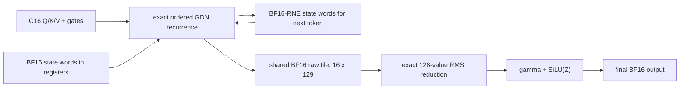

# Exact Prefill GDN dataflow on SM87

Status: the P0 exact composite is implemented at commit `4c135d5` as an
isolated test-only CUDA cell and has passed T1 synthetic correctness and
resource validation on SM87. Qualified full-model/captured-trajectory
retention and production promotion are `NOT_RUN`; production dispatch remains
unchanged.
FlashLinearAttention and Mamba are architecture references only. No source,
generated code, binary, package, or runtime dependency from either project is
copied or introduced.

This plan is subordinate to the
[real-model performance evidence policy](REAL_MODEL_PERFORMANCE_POLICY.md).
Synthetic tensors may prove exhaustive semantics, invalid-call behavior, and
resource safety; they have no performance-retention or production-promotion
authority.

## Current contract and measured boundary

The production Prefill recurrence processes C16 at a time. One 256-thread CTA
owns one of 48 value heads and keeps its 128x128 recurrent state in packed BF16
register words across the 16 ordered tokens. Each state item is converted to
BF16 round-to-nearest-even after every token before the next recurrence step.
That per-token rounding is part of the current exact contract even when the
rounded word remains in a register rather than being written to global memory.

At P513/C512, the current profile attributes 1,536 C16 recurrence launches and
488.585408 ms to GDN across 48 linear-attention layers. The post-GDN
plain-RMSNorm plus SiLU(Z) epilogue is already internally fused, but remains a
separate 48-launch boundary after each layer's complete C512 recurrence.

Two prior experiments establish the guardrails:

- Extending the exact register-state body over the whole C256/C512 span is
  bitwise correct but reaches only 1.02672x/1.01871x against its frozen 1.03x
  production gate. Longer state lifetime alone is closed.
- Keeping FP32 state across each B8 block reaches 2.76977x/2.78551x in the
  micro screen, but changes seven state-rounding boundaries per block. On the
  real P513 checkpoint path its recurrent-state NRMSE is 0.115284 against the
  0.01 gate. Changing chunk size does not repair that semantic mismatch.

## What FlashLinearAttention actually does

This audit pins FlashLinearAttention revision
[`9c8e42e`](https://github.com/fla-org/flash-linear-attention/commit/9c8e42e762fce087c27b673af4922795d9edb85e)
and the [Gated Delta Networks paper](https://arxiv.org/abs/2412.06464).
Its chunked GDN path is a hierarchy rather than one monolithic kernel:

1. transform the forget gate and compute a chunk-local cumulative decay;
2. form the intra-chunk WY representation from KKT and a lower-triangular
   solve;
3. propagate one boundary state sequentially across chunks; and
4. reconstruct token outputs in parallel from the boundary state and
   intra-chunk terms.

The pinned implementation and API are visible in
[`chunk.py`](https://github.com/fla-org/flash-linear-attention/blob/9c8e42e762fce087c27b673af4922795d9edb85e/fla/ops/gated_delta_rule/chunk.py#L33-L123)
and its
[chunk-size dispatch](https://github.com/fla-org/flash-linear-attention/blob/9c8e42e762fce087c27b673af4922795d9edb85e/fla/ops/gated_delta_rule/chunk.py#L395-L588).
Chunk 64 fuses KKT and the solve, while chunk 16/32 separates them in
[`chunk_fwd.py`](https://github.com/fla-org/flash-linear-attention/blob/9c8e42e762fce087c27b673af4922795d9edb85e/fla/ops/gated_delta_rule/chunk_fwd.py#L40-L68).
The cross-chunk state kernel keeps an FP32 state tile live while walking chunk
boundaries and supports a V-first state layout compatible with this project's
logical state orientation; see
[`chunk_delta_h.py`](https://github.com/fla-org/flash-linear-attention/blob/9c8e42e762fce087c27b673af4922795d9edb85e/fla/ops/common/chunk_delta_h.py#L50-L338).
Output reconstruction uses FP32 accumulation and a three-stage tiled path in
[`chunk_o.py`](https://github.com/fla-org/flash-linear-attention/blob/9c8e42e762fce087c27b673af4922795d9edb85e/fla/ops/common/chunk_o.py#L33-L140).

The short-sequence
[`fused_recurrent`](https://github.com/fla-org/flash-linear-attention/blob/9c8e42e762fce087c27b673af4922795d9edb85e/fla/ops/gated_delta_rule/fused_recurrent.py#L30-L179)
path does fuse Q/K L2 normalization, gates, update, and output while retaining
FP32 state, but the layer selects it only for short inference sequences. FLA's
post-GDN RMSNorm plus gate remains a separate fused epilogue; its D<=512
program handles 16/32/64 rows per program in
[`fused_norm_gate.py`](https://github.com/fla-org/flash-linear-attention/blob/9c8e42e762fce087c27b673af4922795d9edb85e/fla/modules/fused_norm_gate.py#L450-L532).

Transferable ideas are the state hierarchy, V-first layout option, fixed chunk
classes, precomputed gates, and tiled epilogue. The FP32 boundary state, WY
composition, TF32-enabled chunk solve, and framework integration are not
eligible for the current exact path.

## What Mamba selective scan contributes

This audit pins Mamba revision
[`e9594ce`](https://github.com/state-spaces/mamba/commit/e9594ce1c732d97440f0332fdc43170a2294dbfa)
and the [Mamba paper](https://arxiv.org/abs/2312.00752). The original selective
scan represents a diagonal recurrence by an associative pair `(a,b)` and uses
CUB BlockScan for an inclusive scan. Its C512 specialization assigns 16 items
to each of 32 threads and fuses dt bias, softplus, residual D, and an optional
SiLU gate in the same kernel; see the
[`SelectiveScanTraits`](https://github.com/state-spaces/mamba/blob/e9594ce1c732d97440f0332fdc43170a2294dbfa/csrc/selective_scan/selective_scan_common.h#L138-L173)
and
[`selective_scan_fwd_kernel.cuh`](https://github.com/state-spaces/mamba/blob/e9594ce1c732d97440f0332fdc43170a2294dbfa/csrc/selective_scan/selective_scan_fwd_kernel.cuh#L72-L308).

GDN cannot use that `float2` scan directly. Its transition contains a 128x128
generalized Householder term, and the current BF16 rounding after each token is
nonlinear. WY is the corresponding algebraic tool only when the state
precision contract permits associative chunk composition.

Mamba-2's [SSD paper](https://arxiv.org/abs/2405.21060) supplies a closer
hierarchy: parallel chunk-state GEMMs, a short sequential state pass across
chunks, and parallel output reconstruction. The official orchestration is in
[`ssd_combined.py`](https://github.com/state-spaces/mamba/blob/e9594ce1c732d97440f0332fdc43170a2294dbfa/mamba_ssm/ops/triton/ssd_combined.py#L343-L394),
with the small state loop in
[`ssd_state_passing.py`](https://github.com/state-spaces/mamba/blob/e9594ce1c732d97440f0332fdc43170a2294dbfa/mamba_ssm/ops/triton/ssd_state_passing.py#L30-L87).
That decomposition is useful for a future numerical-contract research line,
not for bypassing today's per-token BF16 boundary.

## P0 exact composite: C16 recurrence plus post epilogue

The implemented test-only cell keeps the exact C16 recurrence and changes only
where its already-rounded raw output lives before plain-RMSNorm and SiLU(Z):

One CTA still owns one value head. After each token's FP32 state update and
raw output are complete, the raw result is encoded to BF16 exactly as today
and placed in a padded `uint16_t raw_output[16][129]` tile. The tile costs
4,128 bytes. After the recurrence, the CTA processes the 16 token rows with
the same FP32 sum-of-squares pairing, `rsqrtf`, gamma multiply, SiLU, and
BF16-RNE output order as the current standalone epilogue. The recurrence state
is still rounded after every token; only the raw-output global write/read
boundary is replaced by a shared BF16 boundary.

The production exact body reports 64 registers, 34,056 static shared bytes,
zero local bytes, and four CTAs/SM. The T1 compiler and device query now report
64 registers, 38,184 static shared bytes, zero local bytes, and four CTAs/SM
for the shared-boundary candidate. It therefore clears the first resource gate
of zero local bytes and at least three active CTAs/SM while retaining the
four-CTA target.

Two controls separate the sources of improvement:

- `global-boundary composite`: fuse the launch boundary but preserve a BF16
  global store, block synchronization, and reload inside the candidate;
- `shared-boundary composite`: use the padded shared BF16 tile and remove the
  raw global round trip.

The second cell can remove 576 MiB of logical raw-output write-plus-read over
P513 and 48 separate epilogue launches. It does not remove the 1,536 C16
recurrence launches and therefore cannot by itself deliver the FP32-WY
micro-kernel's 2.8x result.

The historical one-shot P513 Nsys attribution gives a planning boundary, not
a retention result: 1,536 exact-C16 GDN calls take 488.585408 ms and 48
standalone epilogues take 32.770496 ms, for 521.355904 ms or 339.424417 us per
C16 cell after spreading the epilogue cost. A composite breaks even below
339.424417 us/cell and clears a 1.03x chain gate at or below 329.538269
us/cell. The 576 MiB figure is logical write-plus-read volume, not measured
DRAM or L2 traffic; it cannot be converted into milliseconds until the
global-boundary and shared-boundary cells are compared on the same pinned real
trajectory.

### P0 T1 result on 2026-07-29

The standalone executable at commit `4c135d5` passed its SM87 T1 run with
synthetic inputs. This is correctness-only evidence: no full-model pinned
prompt path, pinned captured real-layer trajectory, timing loop, B-C-C-B
retention decision, Nsys, NCU, Prefix, or TTFT measurement was run.

| Route | Registers/thread | Static shared | Local bytes | Active CTAs/SM |
| --- | ---: | ---: | ---: | ---: |
| shared BF16 boundary candidate | 64 | 38,184 B | 0 | 4 |
| global BF16 boundary control | 64 | 34,056 B | 0 | 4 |
| frozen production exact C16 | 64 | 34,056 B | 0 | 4 |

The finite fixture proves the shared raw BF16 boundary, final output, and final
state bitwise against the production-plus-standalone-epilogue baseline. The
global-boundary control is also bitwise. A separate NaN fixture proves the same
shared raw, output, and state boundaries without substituting for the finite
epilogue proof. In-place and disjoint state, one-node shared/global Graph
replay, 22 guarded-buffer redzones, eight immutable inputs, seven invalid
calls, and a zero-node invalid capture all pass.

`compute-sanitizer` is **not a passed gate** for this result. Device checking
is unavailable because the target Orin reports its CUDA debug feature disabled;
the sanitizer result is `NOT_RUN`/`NOT_ESTABLISHED`.

The normalized evidence record is
[`qwen36-27b-prefill-gdn-c16-norm-gate-shared-boundary-t1-2026-07-29.json`](metadata/qwen36-27b-prefill-gdn-c16-norm-gate-shared-boundary-t1-2026-07-29.json).
The next admissible decision is a full-model pinned-prompt path or pinned
captured-real-layer-trajectory mirrored B-C-C-B comparison of the standalone
baseline, global-boundary control, and shared-boundary candidate. Isolated real
weights without the corresponding data-dependent activations and state have no
retention authority. Until qualified evidence exists, the experimental
incumbent and production path are unchanged.

## Gates and promotion separation

The experiment and production gates are intentionally different:

1. Exhaustive synthetic smoke proves bitwise C1/C16 outputs and final state,
   in-place/disjoint state, Graph replay, invalid calls, redzones, immutable
   inputs, NaN handling, resource limits, and exact standalone reduction order.
2. Performance retention uses a full-model pinned-prompt path or pinned
   captured real-layer trajectories only. Isolated real weights without the
   corresponding data-dependent activations and recurrent state have no
   retention authority. Each candidate is compared with the current native
   incumbent in mirrored B-C-C-B order. A stable all-positive result may
   become the next test-only experimental incumbent even before it clears the
   production gate.
3. Production promotion separately requires the frozen native production
   threshold, full P257/P513/P769/P1025 output and recurrent-state bitwise
   checks, route-hit proof, fresh fixed-clock Prefix/TTFT repetition, and a new
   Nsight profile showing the GDN interval and global traffic actually fall.
4. cuBLASLt, FLA, Triton, Mamba, and MTP have no retention, promotion,
   fallback, or production role in this line.

## Deferred research-only line

A chunk16/32 WY/SSD prototype becomes meaningful only if the numerical
contract is explicitly reopened. It must then be a separate research binary,
disable TF32 initially, use a full-model pinned-prompt path or pinned captured
real-layer trajectories, and compare output, final state, logits, and longer
continuation against both current production and an installed external GDN
reference. The already rejected FP32-B8 result is the warning: short
generated-token equality is not sufficient evidence for recurrent-state
admission.
