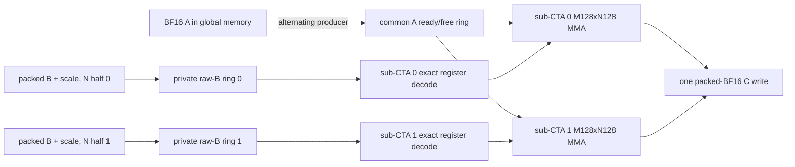

# Large-M projection dataflow on SM87

Status: architecture reset after the exact-C512 NVFP4 Gate/Up head-to-head at
commit `1fcad2f`, updated by the pinned layer-0 Gate matched-NCU comparison at
commit `43308b4` and the retained CF3 complete cell at commit `6e415b8`.

This document defines the next Prefill projection work.  The self-hosted
kernel line is the only line eligible for production: cuBLASLt is an external
performance reference and has no production-dispatch, fallback, or promotion
eligibility.  Historical commits and measurements that called a cuBLASLt
bridge a production route are retained below for provenance, but that status
is explicitly revoked by the qualification policy in this revision.  The
current native production routes remain selected until an accumulated native
candidate clears the self-hosted production gate below.  CF3 is the retained
native experimental baseline for the exact-C512 Gate/Up line.
All timing and profiler evidence in this plan is governed by the
[real-model performance evidence policy](REAL_MODEL_PERFORMANCE_POLICY.md).

## Decisions

1. There is no universal large-M kernel.  Dispatch is selected by quantization
   format, projection role, exact shape, token count, alignment, and payload
   contract.  `N/K` is useful for classifying a family, but is not a sufficient
   production selector.
2. The M64xN256 PairLookup kernel is the reproducible historical native
   control; CF3 supersedes it as the retained native experimental baseline.
   Pinned layer-0 real-weight Gate+Up runs measure PairLookup at about
   11.42--11.45 ms versus 7.20--7.26 ms for the best zero-cuBLASLt-workspace
   reference.  That external reference still uses a reusable 170-MiB BF16
   dequant scratch and can never be selected by production dispatch.
   Synthetic timings have no retention or promotion authority.
3. Single-variable screens resume only after a complete dataflow cell exists.
   Cache policy, tile ownership, synchronization domain, decode placement, and
   pipeline depth are treated as a coupled configuration.
4. `2 CTA/SM` is no longer an architecture-independent hard gate.  The frozen
   residency gate is at least 16 resident warps/SM with no local-memory spill.
   This admits either two independent 256-thread CTAs or one 512-thread CTA
   containing two independently synchronized eight-warp sub-CTAs; equal warp
   count does not by itself prove equal scheduling independence.
5. Synthetic payloads remain useful for exhaustive semantics and deterministic
   regression.  Timing and NCU promotion evidence must use pinned checkpoint
   Gate, Up, Down, or FP8 tensor bytes as appropriate.

## Projection-family matrix

All byte counts below are the one-pass compulsory payloads for C512, before
tile repetition or cache effects.  NVFP4 includes packed E2M1 weights and one
E4M3 scale per group of 16.  FP8 has one byte per weight and a scalar tensor
scale, whose byte cost is negligible here.

| Family | Format | M | N | K | A BF16 | Weight | Block scale | C BF16 | FLOPs |
|---|---|---:|---:|---:|---:|---:|---:|---:|---:|
| MLP Gate / Up | NVFP4 | 512 | 17,408 | 5,120 | 5.000 MiB | 42.500 MiB | 5.312 MiB | 17.000 MiB | 91.268 GF |
| MLP Down | NVFP4 | 512 | 5,120 | 17,408 | 17.000 MiB | 42.500 MiB | 5.312 MiB | 5.000 MiB | 91.268 GF |
| Linear-attention QKV | FP8 | 512 | 10,240 | 5,120 | 5.000 MiB | 50.000 MiB | - | 10.000 MiB | 53.687 GF |
| Linear-attention Z | FP8 | 512 | 6,144 | 5,120 | 5.000 MiB | 30.000 MiB | - | 6.000 MiB | 32.212 GF |
| Attention output | FP8 | 512 | 5,120 | 6,144 | 6.000 MiB | 30.000 MiB | - | 5.000 MiB | 32.212 GF |
| Full-attention Q/gate | FP8 | 512 | 12,288 | 5,120 | 5.000 MiB | 60.000 MiB | - | 12.000 MiB | 64.425 GF |
| Full-attention K or V | FP8 | 512 | 1,024 | 5,120 | 5.000 MiB | 5.000 MiB | - | 1.000 MiB | 5.369 GF |

Gate/Up and Down have identical 91.268-GF arithmetic and identical 69.812-MiB
compulsory I/O, but they are not interchangeable kernels.  Down has 3.4x the
K-stage count and far fewer N tiles.  Startup amortization, grid saturation,
scale-window lifetime, tile order, and useful cache residence therefore differ.
The small-N FP8 K/V family is different again: device saturation and launch
topology can dominate its arithmetic.

## Gap to the external cuBLASLt reference

For a logical native tile, ignoring cache hits and implementation overhead:

| Gate topology | A presentation | Compressed B+scale presentation | C write | Logical total | Compulsory-I/O multiple |
|---|---:|---:|---:|---:|---:|
| M64xN256 | 340.000 MiB | 382.500 MiB | 17.000 MiB | 739.500 MiB | 10.593x |
| M128xN128 | 680.000 MiB | 191.250 MiB | 17.000 MiB | 888.250 MiB | 12.723x |
| M128xN256 | 340.000 MiB | 191.250 MiB | 17.000 MiB | 548.250 MiB | 7.853x |
| M64xN512 | 170.000 MiB | 382.500 MiB | 17.000 MiB | 569.500 MiB | 8.158x |

The current M64xN256 NCU report observes about 1.02 GB of L2 traffic per Gate
branch, above even the 739.5-MiB logical presentation.  Pair lookup removes
integer/permutation work but does not change that structural traffic.  It moves
the bottleneck toward shared/MIO and therefore cannot by itself recover the
36--38% latency reduction required to match the external reference.  Closing
that gap is an architectural objective, not an experiment-retention or
production-promotion prerequisite.

The cuBLASLt reference writes and rereads a 170-MiB BF16 weight matrix.  Its
approximate one-pass logical floor is still about 410 MiB per branch, but the
Lt MMA body organizes that traffic well enough to reach roughly 25 TFLOP/s
effective.  A native kernel can match this external reference only if it
combines lower traffic with comparable Tensor Core feeding; avoiding the BF16
scratch is not sufficient by itself.  It may nevertheless be retained or
promoted through the native-only gates before it reaches that reference.

The same accounting must be repeated for every projection family rather than
transferred from Gate:

| Family and topology | A presentation | Weight/scale presentation | C write | Logical total |
|---|---:|---:|---:|---:|
| Down M128xN128, current native control | 680.000 MiB | 191.250 MiB | 5.000 MiB | 876.250 MiB |
| Down M128xN256, target skeleton | 340.000 MiB | 191.250 MiB | 5.000 MiB | 536.250 MiB |
| FP8 QKV M128xN128 | 400.000 MiB | 200.000 MiB | 10.000 MiB | 610.000 MiB |
| FP8 QKV M128xN256 | 200.000 MiB | 200.000 MiB | 10.000 MiB | 410.000 MiB |
| FP8 Z M128xN128 | 240.000 MiB | 120.000 MiB | 6.000 MiB | 366.000 MiB |
| FP8 Z M128xN256 | 120.000 MiB | 120.000 MiB | 6.000 MiB | 246.000 MiB |
| FP8 output M128xN128 | 240.000 MiB | 120.000 MiB | 5.000 MiB | 365.000 MiB |
| FP8 output M128xN256 | 120.000 MiB | 120.000 MiB | 5.000 MiB | 245.000 MiB |

These are topology bounds, not predicted timings.  In particular, the FP8
rows do not overrule the currently selected native register-feed and
whole-chunk implementations; each target is retained against the current
native experimental champion for its role and is promoted only against the
current native production baseline.

## Primary NVFP4 skeleton: M128xN256 as two sub-CTAs

The first new skeleton is one 512-thread CTA with two eight-warp sub-CTAs.  Each
sub-CTA owns M128xN128 and 64 FP32 accumulator values per thread.  The two
horizontal N halves together own M128xN256 without increasing per-thread
accumulator payload.  Each warp decodes its N panel once and reuses it across
eight ordered M16 panels, while both sub-CTAs reuse the same globally loaded A.

- Gate/Up grid: 68 N tiles x 4 M tiles = 272 CTAs.
- Down grid: 20 N tiles x 4 M tiles = 80 CTAs.
- Residency target: one 16-warp CTA/SM, equal to the current two 8-warp CTAs.
- Register headroom: 512 threads x 128 registers exactly consumes 65,536
  registers.  Any increase is a resource-gate failure, even though the CTA
  still exposes 16 resident warps.
- A: one logical M128xK64 tile is loaded from global memory, initially with
  `cp.async.ca`, and published to both sub-CTAs.  The architecture sketch used
  a three-slot named-barrier ring; the executable P0/P1 cells below use a
  two-slot ring so their 61-KiB shared-memory envelope can be measured first.
  Producer ownership alternates between the two groups in P1.
- Packed B: each group owns its N128 half and a private two-slot raw-B ring.
  Every packed B element and its scale are loaded once from global memory for
  one CTA K traversal, decoded to registers, and reused across M128.
- Scale: each private B ring carries a K256 window reused for four K64 stages.
- Accumulators: remain in registers for the complete K traversal; C is written
  once through the packed BF16 epilogue.
- Synchronization: there is no full-CTA barrier in the K64 steady state.  A
  common-A slot has named `ready` and `free` barriers; both consumers arrive at
  `free` before the producer can refill it.  Each private B ring advances on
  subgroup barriers.  This protocol is a hypothesis to measure, not a claim
  that 16 warps in one CTA already equal two independently scheduled CTAs.
- Pipeline: P0 uses two common-A and two private B/scale slots with a CTA-wide
  steady-state barrier.  P1 keeps the same arithmetic and slot count but uses
  raw SM80 ready/free mbarriers and alternating A producers.  Both are complete
  executable comparisons; the planned three-A-slot, roughly 79.5-KiB cell is
  still unimplemented and receives no performance claim.  Gate and Down may
  select different complete pipeline cells; neither inherits the other's
  result.

This is not the previously rejected ordinary 512-thread implementation.  The
development question is specifically whether alternating common-A production
and two private B/decode domains preserve the issue/tensor utilization of two
CTAs while coupling global A reuse with M128 decoded-B reuse.

One primary M128xN256 K64 steady-state step has the following target balance:

- 16 KiB of BF16 A, 8 KiB of packed B, and an amortized 1 KiB of scale traffic;
- 4.194304 MFLOP;
- 4,096 exact NVFP4 x4 decodes;
- 1,024 warp-level `m16n8k16` MMA instructions.

The historical planning target is at most 3.4737 ms per Gate-equivalent branch,
or at least 26.28 effective TFLOP/s.  NCU planning targets are roughly 60% or
better Tensor throughput, MIO throttle no more than 15%, and barrier stall no
more than 4%.  They are diagnostics, not substitutes for a same-payload paired
native retention or promotion test.

## Complete-cell alternatives

The first alternative keeps the same M128xN256 tile but splits it vertically
into two M64xN256 groups.  It shares each raw B K64 tile across groups, but
performs 8,192 x4 decodes and makes B-slot reuse the cross-group synchronization
boundary.  It reduces shared-A fragment reads relative to the primary mapping
and is therefore retained as a complete-cell comparator, not as the default.

The second alternative is M64xN512, split into two M64xN256 groups.  It shares
A rather than B and reduces Gate logical A presentation to 170 MiB.  The prior
monolithic M64xN512 cell is rejected evidence, not this design: it used a
single synchronization phase and lost issue/tensor utilization.

All three cells carry 16 resident warps, the same per-thread accumulator
payload, and a 512-thread CTA.  They compare complete ownership and
synchronization designs, not isolated cache toggles.

## Gate/Up and Down specializations

The skeleton is shared source infrastructure, not one selected configuration.

| Decision | Gate / Up specialization | Down specialization |
|---|---|---|
| Exact shape | `[512,5120] x [17408,5120]^T` | `[512,17408] x [5120,17408]^T` |
| K64 stages | 80 | 272 |
| M128xN256 grid | 272 | 80 |
| Initial raw pipeline | 2 slots | screen 2 and 3 slots as complete cells |
| Initial tile order | N-major control | N-major and M-major complete cells |
| Initial A policy | `.ca` | `.ca` and `.cg` complete cells |
| Packed B / scale | `.cg`; 20 K256 windows, each reused for 4 K64 stages | `.cg`; 68 K256 windows, each reused for 4 K64 stages |
| Historical external reference | Gate+Up Lt pair, 7.155811 ms | Down inclusive Lt bridge, 4.534723 ms |

No Down result is inferred from Gate NCU.  Each specialization gets pinned
Down payload timing, its own native control comparison, and its own NCU report
before it can alter production.

## FP8 scope

FP8 reuses the registry, residency accounting, exact-shape validation, pinned
checkpoint protocol, and sub-CTA synchronization infrastructure.  It does not
reuse NVFP4 scale/decode code.

- QKV `[10240,5120]` retains its self-hosted production
  fragment-native/register-feed
  sidecar while any new canonical or wider-tile cell is screened against it.
- Z `[6144,5120]` and output `[5120,6144]` remain distinct specializations;
  transposed N/K does not imply the same cache policy.
- Full Q `[12288,5120]` is a large-N throughput cell.
- Full K/V `[1024,5120]` is a small-N saturation cell.  Its 64-CTA C512 grid
  makes tile order and occupancy more important than a Gate-derived pipeline.

FP8 work starts only after a current self-hosted-production NSys audit ranks
its projection families against NVFP4 Gate/Up and Down.  Existing promoted
native FP8 routes are not reopened merely because the NVFP4 skeleton changes.

## Decoder placement

The pair lookup remains a correctness-validated mechanism, not a mandatory
component of the new skeleton.  The pinned layer-0 Gate NCU result supersedes
the earlier synthetic interpretation: the data-indexed table loads account for
24,723,640 excessive shared wavefronts, and the 48-byte B/scale staging layout
accounts for another 16,363,520.  Decoder, shared layout, fragment feed, and
pipeline depth must therefore be replaced as one coupled cell; an isolated XOR
swizzle is not presumed sufficient.

The first two decoder comparisons in the new skeleton are complete cells:

1. a conflict-free exact decoder with fragment-oriented register/shared feed,
   paired with a conflict-free B/scale staging layout;
2. the existing pair lookup retained only as the matched diagnostic control,
   unless a complete new layout removes its real-weight collision pattern.

Half/full warp-shuffle lookup removal is considered only after the raw-bit cell
and only inside the new skeleton.  The rejected full-product table,
scale-factored scalar decoder, global lookup table, B `.ca`, and ordinary
single-phase N512 merge do not appear in the target dataflow.

Three other structures are excluded from the native target:

- persistent scheduling without a new inner dataflow: the measured packed
  persistent-only Down cell reached about 0.511x and does not reduce K-inner
  operand presentation;
- split-K: it introduces FP32 partial-C traffic and changes or threatens the
  frozen accumulation order required for bitwise equality;
- a BF16 weight sidecar: materializing the 170-MiB BF16 matrix is the existing
  cuBLASLt reference mechanism and is excluded from self-hosted production.  A
  future native NVFP4 sidecar may only losslessly permute the same packed
  values and scales with explicit memory ownership and provenance.

## Three-layer qualification sequence

The three gates answer different questions and must not be collapsed into one
threshold.  In particular, the cuBLASLt number is never an opponent in any
gate.  It is measured periodically to show the remaining architectural gap
after several native improvements have accumulated.

### Layer 1: hard validity

- exact supported shape and narrow alignment validation before enqueue;
- exhaustive decoder bits, whole projection, guards, immutable inputs, and
  CUDA Graph replay;
- all invalid and alias cases return before enqueue and capture zero nodes;
- no local memory, no spills, and at least 16 resident warps/SM;
- expected HMMA count and one output write per element;
- SASS confirms the intended cache operators, async copies, named barriers,
  and absence of an accidental global BF16 weight materialization.

Failure at this layer invalidates the experiment regardless of its timing.
Synthetic payloads may exercise this layer, but they cannot provide performance
evidence.

### Layer 2: development retention

- layer-0 Gate and Up tensor bytes, then layer-0 Down tensor bytes;
- same process, same activation and output fixture, fixed clocks and CPU
  affinity;
- each candidate is compared only with the retained native experimental
  champion for the same exact role, shape, and schedule;
- six B-C-C-B rounds must be stable and every round strictly positive.  A
  candidate that passes becomes the new retained native experimental baseline,
  even if its cumulative result remains slower than cuBLASLt;
- NCU is collected only after the timing gate, on the same pinned payload;
- report compulsory/logical/measured traffic, Tensor utilization, issue rate,
  MIO/math/barrier/scoreboard stalls, and shared wavefronts.

The historical Gate+Up Lt pair at 7.155811 ms, its 6.947389-ms 1.03x planning
target, and the Down Lt result at 4.534723 ms remain external regression
references only.  They do not reject, retain, or promote a native candidate.

### Layer 3: self-hosted production promotion

- promotion is evaluated at accumulated native milestones, not after every
  mechanism experiment;
- Gate+Up, Down, and FP8 each compare with the currently selected self-hosted
  native production baseline for that exact role and shape.  A promotion
  candidate must beat that native baseline by at least 1.03x in every paired
  round under the pinned real-weight protocol; Gate results give Down no
  credit, and serial/dual scheduling is compared directly;
- the complete target shape set and all required projection roles must have
  native routes.  No cuBLASLt dispatch or fallback may be required for the
  promoted configuration;
- route only the exact promoted native role/shape and preserve native
  fallbacks;
- P257 remains an unchanged C256 control;
- P513 uses mirrored independent-process B-C-C-B Prefix and TTFT;
- NSys call counts must prove which Gate/Up, Down, and FP8 specialization ran;
- Decode P1/P2 graphs, oracle tokens/state, the full Release suite, request
  memory accounting, and MTP-off policy remain unchanged.

Passing the external cuBLASLt reference is a useful cumulative performance
milestone, but it neither grants nor withholds self-hosted production status.

## 2026-07-28 executable audit result

The pinned payload gate and the first horizontal topology cells are complete.
The full evidence is recorded in
`metadata/qwen36-27b-prefill-c512-shape-specialized-dataflow-audit.json`.

- Gate/Up P0 is exact and spill-free at 128 registers/thread, 61,440 dynamic
  shared bytes, one 512-thread CTA/SM, and 16 resident warps.  Its CTA-wide
  barrier schedule takes 12.015 ms per real-checkpoint pair versus 7.202 ms for
  the external cuBLASLt reference.
- Replacing the steady-state barrier with raw SM80 ready/free mbarriers also
  remains exact and spill-free, but regresses the pair to 13.086 ms.  Per-K64
  multi-barrier control is therefore rejected for this skeleton.
- The failure is not attributed to synthetic payload sensitivity: both cells
  were run against the SHA256-pinned layer-0 Gate and Up tensors, and every
  eager/Graph output was bitwise equal.
- Pinned Down shows a different external-reference gap.  The existing native
  M128 route takes 6.660 ms; the separately compiled public Window8 plus
  zero-workspace cuBLASLt module takes 4.652 ms, or 1.4315x.  Its decoded
  89,128,960-value weight image and 2,621,440-value output are bitwise exact.
- A six-round B-C-C-B comparison measures the ceiling TU at 4.655 ms and the
  public module at 4.652 ms, a 0.0581% difference with every round inside 3%.
  The earlier 4.63-ms ceiling result is therefore valid external-module timing
  rather than an extrapolation from a duplicate implementation.
- Commit `1632976` historically wired the exact-C512 Gate/Up bridge as a
  production route.  Under the current policy it is benchmark-only despite
  being CUDA-Graph safe; any selectable runtime route must be removed or
  disabled before a conforming release.
- Commit `690b899` likewise historically wired the Down bridge as a production
  route.  Its context-creation, zero-workspace selection, 10/10 serial factory,
  and 8/8 four-way contended results remain useful benchmark-harness evidence,
  but provide no production eligibility.

This audit rejects the concrete single-CTA synchronization structures against
their native development controls, not coupled operand reuse in general.  It
also removes the earlier dependency that made Down wait for a successful
native Gate topology: Down now has shape-specific external-reference evidence,
while its development line still advances only through native comparisons.

## 2026-07-29 matched real-weight NCU result

The exact evidence, report hashes, metric caveats, and discarded contaminated
runs are archived in
`metadata/qwen36-27b-gate-c512-matched-ncu-2026-07-29.json`.  Each row below is
a one-launch, kernel-replay diagnostic from an independently started NCU
process.  It is not a substitute for the paired native retention and promotion
timings above.

| Gate target | NCU duration | Achieved occupancy | Tensor throughput | Registers | Shared/CTA |
|---|---:|---:|---:|---:|---:|
| external-reference dequant | 1.282208 ms | 89.796% | 0% | 32 | 0 |
| external cuBLASLt BF16 GEMM | 2.388960 ms | 17.088% | 92.481% | 238 | 147,456 B |
| native NVFP4 M64xN256 | 5.757120 ms | 33.069% | 37.505% | 128 | 44,544 B |

The diagnostic inclusive cuBLASLt reference body is 3.671168 ms, making the native body
1.568198x as slow.  Yet native records only 259,227,968 bytes of L2
system-memory sector proxy traffic versus 513,641,120 bytes for dequant plus
BF16 GEMM, or 50.47%.  These counters are not complete EMC traffic, but they
are sufficient to reject external-memory volume as the primary closing gap in
this profile.  The saved compressed-weight traffic is being consumed by the
native inner dataflow.

The concrete inner-loop gaps are:

- native executes 55,705,600 ordinary shared loads, exactly 800x the BF16
  kernel, while cuBLASLt instead executes 5,587,968 `LDSM` instructions;
- native records 25,890,660 raw shared bank conflicts versus zero for BF16;
  24,723,640 excessive wavefronts map to the data-indexed PairLookup loads and
  16,363,520 more map to the 48-byte B/scale `LDGSTS` destination stride;
- native spends 26.47% of warp cycles per issued instruction in MIO throttle,
  with short-scoreboard and LG-throttle as the next structural stalls, while
  cuBLASLt's dominant wait and math-pipe stalls occur at 92.48% Tensor use;
- native output ownership makes each warp write eight separated 16-byte row
  spans, producing exactly twice the ideal output-store sectors;
- native `cp.async.ca` for A and `cp.async.cg` for B/scale are proven active by
  SASS and exact dynamic `LDGSTS` counts.  The control is therefore pipelined,
  not serial, but it has exactly two resident operand slots;
- the cuBLASLt symbol `stages_64x3` and its exact three-stage-sized shared
  allocation strongly support a K64 three-operand-stage implementation.  This
  is a vendor-private-symbol inference, not a public cuBLASLt contract.

The result changes the optimization question.  Adding `cp.async` is complete;
the next cell must remove the shared decode/feed bottleneck, fix B/scale shared
placement, and coalesce the epilogue while preserving enough independent warps
to cover the remaining load latency.  Pipeline depth is evaluated only after
that cell has a resource budget; a third slot alone cannot repair the measured
MIO and conflict structure.

## 2026-07-29 CF3 complete-cell result

The first coupled successor is implemented and retained as a test-only cell in
commit `6e415b8`.  The exact real-weight timings, report hashes, source-counter
attribution, and caveats are archived in
`metadata/qwen36-27b-gate-c512-cf3-complete-cell-2026-07-29.json`.

The cell combines a three-slot K64 `cp.async` pipeline, separate raw-B and
scale arrays, exact table-free E2M1 decode with direct-register MMA feed, and
an XOR-4 register-shuffle epilogue.  It compiles at 128 registers/thread, zero
local memory, 60,416 dynamic plus 512 static shared bytes, and two 256-thread
CTAs/SM.  All real-checkpoint Gate/Up eager and Graph replays are bitwise exact.

Against the retained PairLookup control, six-round real-weight B-C-C-B gives:

| Gate+Up schedule | PairLookup | CF3 | Speedup | Every round positive |
|---|---:|---:|---:|---:|
| serial | 11.445442 ms | 10.804724 ms | 1.059300x | yes |
| dual | 11.421768 ms | 10.754227 ms | 1.062072x | yes |

This is a stable positive result against the preceding native control, so CF3
is retained and becomes the native experimental baseline under Layer 2.  It
also happens to clear the former 1.03x development-cell margin; that fixed
margin is no longer required for retaining an intermediate improvement.  The
same run measures the external cuBLASLt reference at 7.234311 ms serial and
7.222422 ms dual, so CF3 remains about 1.49x slower than that reference.  This
gap is informational and does not reject CF3.  Native production dispatch is
unchanged because CF3 has not yet completed the accumulated native-production,
full-shape, and end-to-end Layer-3 gate.

Matched NCU agrees with the paired timing: the native Gate body improves from
5.757120 to 5.419456 ms, or 1.062306x.  Tensor throughput rises from 37.505%
to 39.735%, issue active rises from 35.421% to 50.211%, raw shared conflicts
fall 52.40%, and shared excessive wavefronts fall 30.19%.  The epilogue fully
achieves its target: output-store sectors fall from 1,114,112 to the ideal
557,056 without changing the HMMA accumulation or BF16 rounding order.

The `conflict_free_3stage` identifier must not be read as proof that all shared
access is conflict-free.  Source attribution shows 11,141,120 excessive
wavefronts on raw-B `LDS.U8`.  B/scale `LDGSTS` excessive wavefronts increase
from 16,363,520 to 17,540,736 and `.cg` sectors increase 9.83%.  Total
instructions also rise 33.80%, with the new pressure concentrated in exact
table-free PRMT/LOP3/IMAD work.  These facts replace the broader pre-profile
assumption that separating B and scale would by itself close their feed gap.

## Immediate implementation order

1. Preserve the independent self-hosted exact-C512 Gate/Up and Down production
   selectors and add route readiness/hit/fallback observability.  Remove or
   disable any cuBLASLt production dispatch or fallback; keep it in an isolated
   repeatable reference harness only.
2. Prefill CUDA Graph remains a separate launch-overhead project; do not
   describe module-level Graph safety as an already captured production
   Prefill loop.
3. Retain horizontal P0 as a resource/correctness sentinel and P1 as a named-
   barrier negative sentinel.  Do not tune either with isolated cache toggles.
4. Use CF3 as the retained native experimental baseline, freezing its
   three-slot skeleton and coalesced epilogue.  First redesign the scale
   cooperative copy/landing that now owns the largest attributed
   `LDGSTS` and global-sector excess.  Then replace raw-B byte gathers with a
   bank-safe cooperative word load plus lane extraction.  Preserve exact
   accumulation order, 128 registers/thread, zero spill, and two CTAs/SM.
5. After the shared feed is repaired, reduce the table-free decoder's
   PRMT/LOP3/IMAD expansion without reintroducing PairLookup.  Re-run the same
   pinned real-weight six-round B-C-C-B screen against the current retained
   native champion after each complete configuration; keep every stable
   all-positive result and update that champion.  Run matched NCU to attribute
   the retained change.  Synthetic matrices remain correctness/smoke evidence
   only.
6. Keep Gate/Up and Down as separate runtime configurations.  Each advances
   against its own retained native experimental champion; at an accumulated
   milestone, each is compared with its own self-hosted native production
   baseline and full end-to-end gate.  Down receives its own tile order,
   pipeline-depth, pinned timing, and NCU decision rather than inheriting Gate
   settings.
7. Refresh self-hosted production NSys and rank FP8 QKV, Z, O, full Q, and full
   K/V before opening any FP8 kernel line.  Reuse selector and scheduling
   infrastructure, not the NVFP4 decoder.
