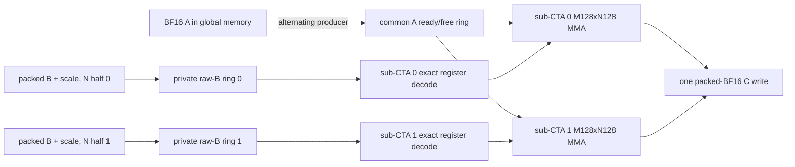

# Large-M projection dataflow on SM87

Status: architecture reset after the exact-C512 NVFP4 Gate/Up head-to-head at
commit `1fcad2f`.

This document defines the next Prefill projection work.  It deliberately does
not promote the current M64xN256 pair-lookup kernel.  The production C512
NVFP4 cuBLASLt bridges and the existing FP8 specializations remain selected
until a new native cell beats its live opponent under the gates below.

## Decisions

1. There is no universal large-M kernel.  Dispatch is selected by quantization
   format, projection role, exact shape, token count, alignment, and payload
   contract.  `N/K` is useful for classifying a family, but is not a sufficient
   production selector.
2. The current M64xN256 kernel is a reproducible native control, not a
   production candidate.  Its best synthetic single-Gate result is
   5.128448 ms, but the stricter same-fixture Gate+Up test measures
   11.37--11.40 ms versus 7.22--7.36 ms for the best zero-cuBLASLt-workspace
   bridge.  That bridge still uses a reusable 170-MiB BF16 dequant scratch.
3. Single-variable screens resume only after a complete dataflow cell exists.
   Cache policy, tile ownership, synchronization domain, decode placement, and
   pipeline depth are treated as a coupled configuration.
4. `2 CTA/SM` is no longer an architecture-independent hard gate.  The frozen
   residency gate is at least 16 resident warps/SM with no local-memory spill.
   This admits either two independent 256-thread CTAs or one 512-thread CTA
   containing two independently synchronized eight-warp sub-CTAs; equal warp
   count does not by itself prove equal scheduling independence.
5. Synthetic payloads remain useful for exhaustive semantics and deterministic
   regression.  Timing and NCU promotion evidence must use pinned checkpoint
   Gate, Up, Down, or FP8 tensor bytes as appropriate.

## Projection-family matrix

All byte counts below are the one-pass compulsory payloads for C512, before
tile repetition or cache effects.  NVFP4 includes packed E2M1 weights and one
E4M3 scale per group of 16.  FP8 has one byte per weight and a scalar tensor
scale, whose byte cost is negligible here.

| Family | Format | M | N | K | A BF16 | Weight | Block scale | C BF16 | FLOPs |
|---|---|---:|---:|---:|---:|---:|---:|---:|---:|
| MLP Gate / Up | NVFP4 | 512 | 17,408 | 5,120 | 5.000 MiB | 42.500 MiB | 5.312 MiB | 17.000 MiB | 91.268 GF |
| MLP Down | NVFP4 | 512 | 5,120 | 17,408 | 17.000 MiB | 42.500 MiB | 5.312 MiB | 5.000 MiB | 91.268 GF |
| Linear-attention QKV | FP8 | 512 | 10,240 | 5,120 | 5.000 MiB | 50.000 MiB | - | 10.000 MiB | 53.687 GF |
| Linear-attention Z | FP8 | 512 | 6,144 | 5,120 | 5.000 MiB | 30.000 MiB | - | 6.000 MiB | 32.212 GF |
| Attention output | FP8 | 512 | 5,120 | 6,144 | 6.000 MiB | 30.000 MiB | - | 5.000 MiB | 32.212 GF |
| Full-attention Q/gate | FP8 | 512 | 12,288 | 5,120 | 5.000 MiB | 60.000 MiB | - | 12.000 MiB | 64.425 GF |
| Full-attention K or V | FP8 | 512 | 1,024 | 5,120 | 5.000 MiB | 5.000 MiB | - | 1.000 MiB | 5.369 GF |

Gate/Up and Down have identical 91.268-GF arithmetic and identical 69.812-MiB
compulsory I/O, but they are not interchangeable kernels.  Down has 3.4x the
K-stage count and far fewer N tiles.  Startup amortization, grid saturation,
scale-window lifetime, tile order, and useful cache residence therefore differ.
The small-N FP8 K/V family is different again: device saturation and launch
topology can dominate its arithmetic.

## Why the current Gate cell cannot close the bridge gap

For a logical native tile, ignoring cache hits and implementation overhead:

| Gate topology | A presentation | Compressed B+scale presentation | C write | Logical total | Compulsory-I/O multiple |
|---|---:|---:|---:|---:|---:|
| M64xN256 | 340.000 MiB | 382.500 MiB | 17.000 MiB | 739.500 MiB | 10.593x |
| M128xN128 | 680.000 MiB | 191.250 MiB | 17.000 MiB | 888.250 MiB | 12.723x |
| M128xN256 | 340.000 MiB | 191.250 MiB | 17.000 MiB | 548.250 MiB | 7.853x |
| M64xN512 | 170.000 MiB | 382.500 MiB | 17.000 MiB | 569.500 MiB | 8.158x |

The current M64xN256 NCU report observes about 1.02 GB of L2 traffic per Gate
branch, above even the 739.5-MiB logical presentation.  Pair lookup removes
integer/permutation work but does not change that structural traffic.  It moves
the bottleneck toward shared/MIO and therefore cannot by itself recover the
36--38% latency reduction required to beat and safely promote over the bridge.

The bridge writes and rereads a 170-MiB BF16 weight matrix.  Its approximate
one-pass logical floor is still about 410 MiB per branch, but the Lt MMA body
organizes that traffic well enough to reach roughly 25 TFLOP/s effective.  A
native kernel wins only if it combines lower traffic with comparable Tensor
Core feeding; avoiding the BF16 scratch is not sufficient by itself.

The same accounting must be repeated for every projection family rather than
transferred from Gate:

| Family and topology | A presentation | Weight/scale presentation | C write | Logical total |
|---|---:|---:|---:|---:|
| Down M128xN128, current native control | 680.000 MiB | 191.250 MiB | 5.000 MiB | 876.250 MiB |
| Down M128xN256, target skeleton | 340.000 MiB | 191.250 MiB | 5.000 MiB | 536.250 MiB |
| FP8 QKV M128xN128 | 400.000 MiB | 200.000 MiB | 10.000 MiB | 610.000 MiB |
| FP8 QKV M128xN256 | 200.000 MiB | 200.000 MiB | 10.000 MiB | 410.000 MiB |
| FP8 Z M128xN128 | 240.000 MiB | 120.000 MiB | 6.000 MiB | 366.000 MiB |
| FP8 Z M128xN256 | 120.000 MiB | 120.000 MiB | 6.000 MiB | 246.000 MiB |
| FP8 output M128xN128 | 240.000 MiB | 120.000 MiB | 5.000 MiB | 365.000 MiB |
| FP8 output M128xN256 | 120.000 MiB | 120.000 MiB | 5.000 MiB | 245.000 MiB |

These are topology bounds, not predicted timings.  In particular, the FP8
rows do not overrule the currently selected register-feed and whole-chunk
implementations; each target must beat the live role-specific opponent.

## Primary NVFP4 skeleton: M128xN256 as two sub-CTAs

The first new skeleton is one 512-thread CTA with two eight-warp sub-CTAs.  Each
sub-CTA owns M128xN128 and 64 FP32 accumulator values per thread.  The two
horizontal N halves together own M128xN256 without increasing per-thread
accumulator payload.  Each warp decodes its N panel once and reuses it across
eight ordered M16 panels, while both sub-CTAs reuse the same globally loaded A.

- Gate/Up grid: 68 N tiles x 4 M tiles = 272 CTAs.
- Down grid: 20 N tiles x 4 M tiles = 80 CTAs.
- Residency target: one 16-warp CTA/SM, equal to the current two 8-warp CTAs.
- Register headroom: 512 threads x 128 registers exactly consumes 65,536
  registers.  Any increase is a resource-gate failure, even though the CTA
  still exposes 16 resident warps.
- A: one logical M128xK64 tile is loaded from global memory, initially with
  `cp.async.ca`, and published to both sub-CTAs through a three-slot named-
  barrier ring.  Producer ownership alternates between the two groups.
- Packed B: each group owns its N128 half and a private two-slot raw-B ring.
  Every packed B element and its scale are loaded once from global memory for
  one CTA K traversal, decoded to registers, and reused across M128.
- Scale: each private B ring carries a K256 window reused for four K64 stages.
- Accumulators: remain in registers for the complete K traversal; C is written
  once through the packed BF16 epilogue.
- Synchronization: there is no full-CTA barrier in the K64 steady state.  A
  common-A slot has named `ready` and `free` barriers; both consumers arrive at
  `free` before the producer can refill it.  Each private B ring advances on
  subgroup barriers.  This protocol is a hypothesis to measure, not a claim
  that 16 warps in one CTA already equal two independently scheduled CTAs.
- Pipeline: the first complete cell uses a three-slot common-A ring and two
  private two-slot B/scale rings, about 79.5 KiB shared including lookup state.
  It is intended to let one group advance A while the other computes a prior
  stage.  Gate and Down may select different complete pipeline cells; neither
  inherits the other's result.

This is not the previously rejected ordinary 512-thread implementation.  The
admission question is specifically whether alternating common-A production and
two private B/decode domains preserve the issue/tensor utilization of two CTAs
while coupling global A reuse with M128 decoded-B reuse.

One primary M128xN256 K64 steady-state step has the following target balance:

- 16 KiB of BF16 A, 8 KiB of packed B, and an amortized 1 KiB of scale traffic;
- 4.194304 MFLOP;
- 4,096 exact NVFP4 x4 decodes;
- 1,024 warp-level `m16n8k16` MMA instructions.

The historical planning target is at most 3.4737 ms per Gate-equivalent branch,
or at least 26.28 effective TFLOP/s.  NCU planning targets are roughly 60% or
better Tensor throughput, MIO throttle no more than 15%, and barrier stall no
more than 4%.  They are diagnostics, not substitutes for a live same-payload
paired admission test.

## Complete-cell alternatives

The first alternative keeps the same M128xN256 tile but splits it vertically
into two M64xN256 groups.  It shares each raw B K64 tile across groups, but
performs 8,192 x4 decodes and makes B-slot reuse the cross-group synchronization
boundary.  It reduces shared-A fragment reads relative to the primary mapping
and is therefore retained as a complete-cell comparator, not as the default.

The second alternative is M64xN512, split into two M64xN256 groups.  It shares
A rather than B and reduces Gate logical A presentation to 170 MiB.  The prior
monolithic M64xN512 cell is rejected evidence, not this design: it used a
single synchronization phase and lost issue/tensor utilization.

All three cells carry 16 resident warps, the same per-thread accumulator
payload, and a 512-thread CTA.  They compare complete ownership and
synchronization designs, not isolated cache toggles.

## Gate/Up and Down specializations

The skeleton is shared source infrastructure, not one selected configuration.

| Decision | Gate / Up specialization | Down specialization |
|---|---|---|
| Exact shape | `[512,5120] x [17408,5120]^T` | `[512,17408] x [5120,17408]^T` |
| K64 stages | 80 | 272 |
| M128xN256 grid | 272 | 80 |
| Initial raw pipeline | 2 slots | screen 2 and 3 slots as complete cells |
| Initial tile order | N-major control | N-major and M-major complete cells |
| Initial A policy | `.ca` | `.ca` and `.cg` complete cells |
| Packed B / scale | `.cg`; 20 K256 windows, each reused for 4 K64 stages | `.cg`; 68 K256 windows, each reused for 4 K64 stages |
| Historical regression anchor | Gate+Up Lt pair, 7.155811 ms | Down inclusive Lt bridge, 4.534723 ms |

No Down result is inferred from Gate NCU.  Each specialization gets pinned
Down payload timing and its own NCU report before it can alter production.

## FP8 scope

FP8 reuses the registry, residency accounting, exact-shape validation, pinned
checkpoint protocol, and sub-CTA synchronization infrastructure.  It does not
reuse NVFP4 scale/decode code.

- QKV `[10240,5120]` retains its production fragment-native/register-feed
  sidecar while any new canonical or wider-tile cell is screened against it.
- Z `[6144,5120]` and output `[5120,6144]` remain distinct specializations;
  transposed N/K does not imply the same cache policy.
- Full Q `[12288,5120]` is a large-N throughput cell.
- Full K/V `[1024,5120]` is a small-N saturation cell.  Its 64-CTA C512 grid
  makes tile order and occupancy more important than a Gate-derived pipeline.

FP8 work starts only after a current-production NSys audit ranks its projection
families against NVFP4 Gate/Up and Down.  Existing promoted FP8 routes are not
reopened merely because the NVFP4 skeleton changes.

## Decoder placement

The pair lookup remains a validated mechanism, not a mandatory component of
the new skeleton.  Its current synthetic NCU adds essentially one shared
wavefront per lookup, so XOR bank swizzling is not the next action.  A static
model over pinned layer-0 Gate/Up bytes predicts about 3.22 wavefronts per
lookup, which makes real-payload measurement mandatory.

The first two decoder implementations in the new skeleton are complete cells:

1. retained table-free exact decoder, to isolate the topology without lookup
   distribution sensitivity;
2. pair lookup with the redundant BF16x2 unpack/repack removed so its hot path
   is `LDS -> HFMA2`, followed by pinned-checkpoint timing and NCU.

Half/full warp-shuffle lookup removal is considered only after the raw-bit cell
and only inside the new skeleton.  The rejected full-product table,
scale-factored scalar decoder, global lookup table, B `.ca`, and ordinary
single-phase N512 merge do not appear in the target dataflow.

Three other structures are excluded from the native target:

- persistent scheduling without a new inner dataflow: the measured packed
  persistent-only Down cell reached about 0.511x and does not reduce K-inner
  operand presentation;
- split-K: it introduces FP32 partial-C traffic and changes or threatens the
  frozen accumulation order required for bitwise equality;
- a BF16 weight sidecar: materializing the 170-MiB BF16 matrix is the existing
  bridge mechanism.  A future NVFP4 sidecar may only losslessly permute the
  same packed values and scales with explicit memory ownership and provenance.

## Admission sequence

### P0: static and semantic feasibility

- exact supported shape and narrow alignment validation before enqueue;
- exhaustive decoder bits, whole projection, guards, immutable inputs, and
  CUDA Graph replay;
- all invalid and alias cases return before enqueue and capture zero nodes;
- no local memory, no spills, and at least 16 resident warps/SM;
- expected HMMA count and one output write per element;
- SASS confirms the intended cache operators, async copies, named barriers,
  and absence of an accidental global BF16 weight materialization.

### P1: pinned single-layer mechanism screen

- layer-0 Gate and Up tensor bytes, then layer-0 Down tensor bytes;
- same process, same activation and output fixture, fixed clocks and CPU
  affinity;
- six B-C-C-B rounds, every round strictly positive versus the family opponent;
- NCU is collected only after the timing gate, on the same pinned payload;
- report compulsory/logical/measured traffic, Tensor utilization, issue rate,
  MIO/math/barrier/scoreboard stalls, and shared wavefronts.

### P2: production-selection screen

- Gate+Up must beat a live cuBLASLt pair by at least 1.03x in every paired
  round, in the same process and on the same pinned payload.  The historical
  7.155811-ms pair and its 6.947389-ms 1.03x planning target are regression
  anchors, not hard denominators for a future checkpoint run.
- Down must independently beat its live same-payload inclusive Lt opponent by
  at least 1.03x; the historical 4.534723-ms result is only a regression
  anchor, and Gate results provide no credit.
- FP8 must beat the currently selected specialization for that exact role and
  shape, not an older generic control.
- serial/dual scheduling is compared directly.  The current M64 native dual
  result of about 1.0022x is below an engineering promotion margin.

### P3: production and end-to-end

- route only the exact admitted role/shape; preserve bridge and native
  fallbacks;
- P257 remains an unchanged C256 control;
- P513 uses mirrored independent-process B-C-C-B Prefix and TTFT;
- NSys call counts must prove which Gate/Up, Down, and FP8 specialization ran;
- Decode P1/P2 graphs, oracle tokens/state, the full Release suite, request
  memory accounting, and MTP-off policy remain unchanged.

## Immediate implementation order

1. Add pinned NVFP4 Gate/Up and Down payload support to the isolated large-M
   screens.  No more promotion timing is accepted from synthetic weights alone.
2. Build a resource-only horizontal M128xN256 512-thread skeleton with two
   M128xN128 named-barrier sub-CTAs and the retained table-free decoder.
3. Admit exact/Graph/resource gates before running performance.
4. Compare complete topology cells, not isolated cache toggles: horizontal
   M128xN256, vertical M128xN256, M64xN512, and the frozen M64xN256 control.
5. Only after a topology clears the pinned Gate/Up bridge gate, specialize and
   screen the long-K Down configuration.
6. Refresh production NSys and rank the existing FP8 families before opening a
   new FP8 kernel line.
