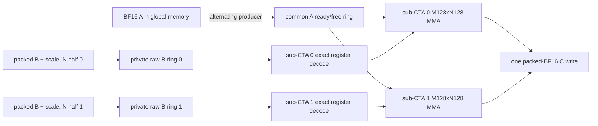

# Large-M projection dataflow on SM87

Status: architecture reset after the exact-C512 NVFP4 Gate/Up head-to-head at
commit `1fcad2f`, updated by the pinned layer-0 Gate matched-NCU comparison at
commit `43308b4`, the retained CF3 complete cell at commit `6e415b8`, and the
retained structured BS512 cell at commit `18c89ac`.  The post-isolation
BS512/BF16/dequant matched-NCU decomposition is pinned at commit `9908add`,
and the 256-thread M128xN256 successor is retained at commit `375f8df`.  Its
source-identical M64-to-M128 matched-NCU attribution is pinned to that same
implementation commit. Commit `55da501` promotes this cell for the exact C512
Gate/Up production route after real-path P513 and full validation. Commit
`398305c` promotes strict one-dimensional A-stationary CTA traversal, and
commit `d7aa73b` promotes the K128/two-slot pipeline after real-model B-C-C-B,
matched NCU, and the full Release suite.

This document defines the next Prefill projection work.  The self-hosted
kernel line is the only line eligible for production: cuBLASLt is an external
performance reference and has no production-dispatch, fallback, or promotion
eligibility.  Historical commits and measurements that called a cuBLASLt
bridge a production route are retained below for provenance, but that status
is explicitly revoked by the qualification policy in this revision. The
exact C512 Gate/Up production route now uses the 256-thread
M128xN256xK128 BS512 cell with a two-slot pipeline and strict one-dimensional
A-stationary traversal; C256 remains on its independent M128xN128 route. This
promoted cell is also the native baseline that the next C512 experiments must
beat.
All timing and profiler evidence in this plan is governed by the
[real-model performance evidence policy](REAL_MODEL_PERFORMANCE_POLICY.md).

## Decisions

1. There is no universal large-M kernel.  Dispatch is selected by quantization
   format, projection role, exact shape, token count, alignment, and payload
   contract.  `N/K` is useful for classifying a family, but is not a sufficient
   production selector.
2. The M64xN256 PairLookup kernel is the reproducible historical native
   control; CF3 superseded it, structured BS512 superseded CF3, and the
   256-thread M128xN256 reuse cell superseded structured BS512. Its later
   A-stationary K128/two-slot configuration is now the exact-C512 native
   production and development baseline.
   Pinned layer-0 real-weight Gate+Up runs measure PairLookup at about
   11.42--11.45 ms versus 7.20--7.26 ms for the best zero-cuBLASLt-workspace
   reference.  That external reference still uses a reusable 170-MiB BF16
   dequant scratch and can never be selected by production dispatch.
   Synthetic timings have no retention or promotion authority.
3. Single-variable screens resume only after a complete dataflow cell exists.
   Cache policy, tile ownership, synchronization domain, decode placement, and
   pipeline depth are treated as a coupled configuration.
4. `2 CTA/SM` and 16 resident warps/SM are incumbent heuristics, not
   architecture-independent validity gates.  A shape-specific structural
   prototype may use one 256-thread CTA/SM when its wider M reuse makes two
   CTAs physically impossible.  It must still have zero local-memory spill and
   pass the same real-weight native timing and full production gates; the
   exception does not relax any existing production route automatically.
5. Synthetic payloads remain useful for exhaustive semantics and deterministic
   regression.  Timing and NCU promotion evidence must use pinned checkpoint
   Gate, Up, Down, or FP8 tensor bytes as appropriate.

## Projection-family matrix

All byte counts below are the one-pass compulsory payloads for C512, before
tile repetition or cache effects.  NVFP4 includes packed E2M1 weights and one
E4M3 scale per group of 16.  FP8 has one byte per weight and a scalar tensor
scale, whose byte cost is negligible here.

| Family | Format | M | N | K | A BF16 | Weight | Block scale | C BF16 | FLOPs |
|---|---|---:|---:|---:|---:|---:|---:|---:|---:|
| MLP Gate / Up | NVFP4 | 512 | 17,408 | 5,120 | 5.000 MiB | 42.500 MiB | 5.312 MiB | 17.000 MiB | 91.268 GF |
| MLP Down | NVFP4 | 512 | 5,120 | 17,408 | 17.000 MiB | 42.500 MiB | 5.312 MiB | 5.000 MiB | 91.268 GF |
| Linear-attention QKV | FP8 | 512 | 10,240 | 5,120 | 5.000 MiB | 50.000 MiB | - | 10.000 MiB | 53.687 GF |
| Linear-attention Z | FP8 | 512 | 6,144 | 5,120 | 5.000 MiB | 30.000 MiB | - | 6.000 MiB | 32.212 GF |
| Attention output | FP8 | 512 | 5,120 | 6,144 | 6.000 MiB | 30.000 MiB | - | 5.000 MiB | 32.212 GF |
| Full-attention Q/gate | FP8 | 512 | 12,288 | 5,120 | 5.000 MiB | 60.000 MiB | - | 12.000 MiB | 64.425 GF |
| Full-attention K or V | FP8 | 512 | 1,024 | 5,120 | 5.000 MiB | 5.000 MiB | - | 1.000 MiB | 5.369 GF |

Gate/Up and Down have identical 91.268-GF arithmetic and identical 69.812-MiB
compulsory I/O, but they are not interchangeable kernels.  Down has 3.4x the
K-stage count and far fewer N tiles.  Startup amortization, grid saturation,
scale-window lifetime, tile order, and useful cache residence therefore differ.
The small-N FP8 K/V family is different again: device saturation and launch
topology can dominate its arithmetic.

## Gap to the external cuBLASLt reference

For a logical native tile, ignoring cache hits and implementation overhead:

| Gate topology | A presentation | Compressed B+scale presentation | C write | Logical total | Compulsory-I/O multiple |
|---|---:|---:|---:|---:|---:|
| M64xN256 | 340.000 MiB | 382.500 MiB | 17.000 MiB | 739.500 MiB | 10.593x |
| M128xN128 | 680.000 MiB | 191.250 MiB | 17.000 MiB | 888.250 MiB | 12.723x |
| M128xN256 | 340.000 MiB | 191.250 MiB | 17.000 MiB | 548.250 MiB | 7.853x |
| M64xN512 | 170.000 MiB | 382.500 MiB | 17.000 MiB | 569.500 MiB | 8.158x |

The current M64xN256 NCU report observes about 1.02 GB of L2 traffic per Gate
branch, above even the 739.5-MiB logical presentation.  Pair lookup removes
integer/permutation work but does not change that structural traffic.  It moves
the bottleneck toward shared/MIO and therefore cannot by itself recover the
36--38% latency reduction required to match the external reference.  Closing
that gap is an architectural objective, not an experiment-retention or
production-promotion prerequisite.

The cuBLASLt reference writes and rereads a 170-MiB BF16 weight matrix.  Its
approximate one-pass logical floor is still about 410 MiB per branch, but the
Lt MMA body organizes that traffic well enough to reach roughly 25 TFLOP/s
effective.  A native kernel can match this external reference only if it
combines lower traffic with comparable Tensor Core feeding; avoiding the BF16
scratch is not sufficient by itself.  It may nevertheless be retained or
promoted through the native-only gates before it reaches that reference.

The same accounting must be repeated for every projection family rather than
transferred from Gate:

| Family and topology | A presentation | Weight/scale presentation | C write | Logical total |
|---|---:|---:|---:|---:|
| Down M128xN128, current native control | 680.000 MiB | 191.250 MiB | 5.000 MiB | 876.250 MiB |
| Down M128xN256, target skeleton | 340.000 MiB | 191.250 MiB | 5.000 MiB | 536.250 MiB |
| FP8 QKV M128xN128 | 400.000 MiB | 200.000 MiB | 10.000 MiB | 610.000 MiB |
| FP8 QKV M128xN256 | 200.000 MiB | 200.000 MiB | 10.000 MiB | 410.000 MiB |
| FP8 Z M128xN128 | 240.000 MiB | 120.000 MiB | 6.000 MiB | 366.000 MiB |
| FP8 Z M128xN256 | 120.000 MiB | 120.000 MiB | 6.000 MiB | 246.000 MiB |
| FP8 output M128xN128 | 240.000 MiB | 120.000 MiB | 5.000 MiB | 365.000 MiB |
| FP8 output M128xN256 | 120.000 MiB | 120.000 MiB | 5.000 MiB | 245.000 MiB |

These are topology bounds, not predicted timings.  In particular, the FP8
rows do not overrule the currently selected native register-feed and
whole-chunk implementations; each target is retained against the current
native experimental champion for its role and is promoted only against the
current native production baseline.

## Retained and promoted NVFP4 cell: one 256-thread M128xN256 CTA

The retained Gate experiment grows the prior BS512 CTA vertically from
M64 to M128 without widening its eight-warp thread block.  It keeps BS512's
three raw-operand stages, 16-byte B half-swizzle, K512 scale superwindows,
table-free decoder, K-stage order, and packed-BF16 epilogue.  Only the token
reuse domain changes: each decoded B fragment is consumed by eight M16 panels
instead of four.

- Gate grid: 68 N tiles x 4 M tiles = 272 CTAs, or 17 waves on 16 SMs.
- Threads: 256; one warp owns M128xN32.  Each thread carries 8x4 accumulator
  fragments, or 128 FP32 accumulator values before feed and address state.
- Dynamic shared: 96,256 bytes: 55,296 bytes for three M128xK72 activation
  slots, 24,576 bytes for three packed-B slots, and 16,384 bytes for two K512
  scale windows.  The existing static E4M3 lookup remains 512 bytes.
- Resource gate: at most 255 registers/thread, zero local bytes, one valid
  CTA/SM, 256 threads, and the exact shared-memory envelope above.
- Semantic gate: preserve the exact K64/K16 accumulation order and compare all
  Gate and Up BF16 bits, eager replay, Graph replay, invalid shapes,
  alignments, canaries, and immutable inputs.
- Retention gate: six real-checkpoint B-C-C-B rounds against structured BS512;
  passed for both serial and dual schedules. cuBLASLt had no vote in that
  decision and was absent from the native-only binary.

This is intentionally not a cache-policy micro-tune.  It halves the CTA count
and approximately halves raw-B landing, exact decode, scale presentation, and
barrier work while retaining the proven BS512 feed mechanisms.  The matched
BF16 reference reaches high Tensor utilization with the same 272-CTA,
256-thread, one-CTA/SM geometry, making this a credible shape-specialized
exception to the incumbent two-CTA heuristic. Its lack of an NVFP4 decoder
means it is
evidence of schedulability, not evidence that the new native cell will win.

Commit `375f8df` implements that test-only cell. The exact native-only record
is
[`metadata/qwen36-27b-gate-c512-m128n256-bs512-256t-retention-2026-07-29.json`](metadata/qwen36-27b-gate-c512-m128n256-bs512-256t-retention-2026-07-29.json).
The compiler reports 241 registers/thread, 96,256 dynamic plus 512 static
shared bytes, zero local bytes, 256 threads, and one CTA/SM. Gate and Up are
bitwise exact through eager and Graph replay; four invalid calls capture zero
Graph nodes.

Against structured BS512, six real-weight B-C-C-B rounds retain the new cell:

| Gate+Up schedule | Structured BS512 | M128xN256 256T | Speedup | Every round positive |
|---|---:|---:|---:|---:|
| serial | 10.184074 ms | 9.372453 ms | 1.086596x | yes |
| dual | 10.115721 ms | 9.324912 ms | 1.084806x | yes |

Dual is also uniformly faster than serial at 1.005214x. This table records the
development retention step; commit `55da501` subsequently promotes the same
kernel for C512. Fixed-clock real-path P513 Prefix improves from 2559.131 to
2331.928 ms (1.097431x), or from 200.067914 to 219.560810 token/s, while TTFT
improves from 2685.244 to 2457.942 ms. The production record is
[`metadata/qwen36-27b-prefill-gate-c512-m128n256-production-2026-07-29.json`](metadata/qwen36-27b-prefill-gate-c512-m128n256-production-2026-07-29.json).

## Prior wide-CTA skeleton: M128xN256 as two sub-CTAs

The earlier wide-CTA skeleton is one 512-thread CTA with two eight-warp
sub-CTAs.  It remains a resource/correctness sentinel rather than the immediate
performance route.  Each
sub-CTA owns M128xN128 and 64 FP32 accumulator values per thread.  The two
horizontal N halves together own M128xN256 without increasing per-thread
accumulator payload.  Each warp decodes its N panel once and reuses it across
eight ordered M16 panels, while both sub-CTAs reuse the same globally loaded A.

- Gate/Up grid: 68 N tiles x 4 M tiles = 272 CTAs.
- Down grid: 20 N tiles x 4 M tiles = 80 CTAs.
- Residency target: one 16-warp CTA/SM, equal to the current two 8-warp CTAs.
- Register headroom: 512 threads x 128 registers exactly consumes 65,536
  registers.  Any increase is a resource-gate failure, even though the CTA
  still exposes 16 resident warps.
- A: one logical M128xK64 tile is loaded from global memory, initially with
  `cp.async.ca`, and published to both sub-CTAs.  The architecture sketch used
  a three-slot named-barrier ring; the executable P0/P1 cells below use a
  two-slot ring so their 61-KiB shared-memory envelope can be measured first.
  Producer ownership alternates between the two groups in P1.
- Packed B: each group owns its N128 half and a private two-slot raw-B ring.
  Every packed B element and its scale are loaded once from global memory for
  one CTA K traversal, decoded to registers, and reused across M128.
- Scale: each private B ring carries a K256 window reused for four K64 stages.
- Accumulators: remain in registers for the complete K traversal; C is written
  once through the packed BF16 epilogue.
- Synchronization: there is no full-CTA barrier in the K64 steady state.  A
  common-A slot has named `ready` and `free` barriers; both consumers arrive at
  `free` before the producer can refill it.  Each private B ring advances on
  subgroup barriers.  This protocol is a hypothesis to measure, not a claim
  that 16 warps in one CTA already equal two independently scheduled CTAs.
- Pipeline: P0 uses two common-A and two private B/scale slots with a CTA-wide
  steady-state barrier.  P1 keeps the same arithmetic and slot count but uses
  raw SM80 ready/free mbarriers and alternating A producers.  Both are complete
  executable comparisons; the planned three-A-slot, roughly 79.5-KiB cell is
  still unimplemented and receives no performance claim.  Gate and Down may
  select different complete pipeline cells; neither inherits the other's
  result.



This is not the previously rejected ordinary 512-thread implementation.  The
development question is specifically whether alternating common-A production
and two private B/decode domains preserve the issue/tensor utilization of two
CTAs while coupling global A reuse with M128 decoded-B reuse.

One primary M128xN256 K64 steady-state step has the following target balance:

- 16 KiB of BF16 A, 8 KiB of packed B, and an amortized 1 KiB of scale traffic;
- 4.194304 MFLOP;
- 4,096 exact NVFP4 x4 decodes;
- 1,024 warp-level `m16n8k16` MMA instructions.

The historical planning target is at most 3.4737 ms per Gate-equivalent branch,
or at least 26.28 effective TFLOP/s.  NCU planning targets are roughly 60% or
better Tensor throughput, MIO throttle no more than 15%, and barrier stall no
more than 4%.  They are diagnostics, not substitutes for a same-payload paired
native retention or promotion test.

## Complete-cell alternatives

The first alternative keeps the same M128xN256 tile but splits it vertically
into two M64xN256 groups.  It shares each raw B K64 tile across groups, but
performs 8,192 x4 decodes and makes B-slot reuse the cross-group synchronization
boundary.  It reduces shared-A fragment reads relative to the primary mapping
and is therefore retained as a complete-cell comparator, not as the default.

The second alternative is M64xN512, split into two M64xN256 groups.  It shares
A rather than B and reduces Gate logical A presentation to 170 MiB.  The prior
monolithic M64xN512 cell is rejected evidence, not this design: it used a
single synchronization phase and lost issue/tensor utilization.

All three cells carry 16 resident warps, the same per-thread accumulator
payload, and a 512-thread CTA.  They compare complete ownership and
synchronization designs, not isolated cache toggles.

## Gate/Up and Down specializations

The skeleton is shared source infrastructure, not one selected configuration.

| Decision | Gate / Up specialization | Down specialization |
|---|---|---|
| Exact shape | `[512,5120] x [17408,5120]^T` | `[512,17408] x [5120,17408]^T` |
| K64 stages | 80 | 272 |
| M128xN256 grid | 272 | 80 |
| Initial raw pipeline | 2 slots | screen 2 and 3 slots as complete cells |
| Initial tile order | N-major control | N-major and M-major complete cells |
| Initial A policy | `.ca` | `.ca` and `.cg` complete cells |
| Packed B / scale | `.cg`; 20 K256 windows, each reused for 4 K64 stages | `.cg`; 68 K256 windows, each reused for 4 K64 stages |
| Historical external reference | Gate+Up Lt pair, 7.155811 ms | Down inclusive Lt bridge, 4.534723 ms |

No Down result is inferred from Gate NCU.  Each specialization gets pinned
Down payload timing, its own native control comparison, and its own NCU report
before it can alter production.

## FP8 scope

FP8 reuses the registry, residency accounting, exact-shape validation, pinned
checkpoint protocol, and sub-CTA synchronization infrastructure.  It does not
reuse NVFP4 scale/decode code.

- QKV `[10240,5120]` retains its self-hosted production
  fragment-native/register-feed
  sidecar while any new canonical or wider-tile cell is screened against it.
- Z `[6144,5120]` and output `[5120,6144]` remain distinct specializations;
  transposed N/K does not imply the same cache policy.
- Full Q `[12288,5120]` is a large-N throughput cell.
- Full K/V `[1024,5120]` is a small-N saturation cell.  Its 64-CTA C512 grid
  makes tile order and occupancy more important than a Gate-derived pipeline.

FP8 work starts only after a current self-hosted-production NSys audit ranks
its projection families against NVFP4 Gate/Up and Down.  Existing promoted
native FP8 routes are not reopened merely because the NVFP4 skeleton changes.

## Decoder placement

The pair lookup remains a correctness-validated mechanism, not a mandatory
component of the new skeleton.  The pinned layer-0 Gate NCU result supersedes
the earlier synthetic interpretation: the data-indexed table loads account for
24,723,640 excessive shared wavefronts, and the 48-byte B/scale staging layout
accounts for another 16,363,520.  Decoder, shared layout, fragment feed, and
pipeline depth must therefore be replaced as one coupled cell; an isolated XOR
swizzle is not presumed sufficient.

The first two decoder comparisons in the new skeleton are complete cells:

1. a conflict-free exact decoder with fragment-oriented register/shared feed,
   paired with a conflict-free B/scale staging layout;
2. the existing pair lookup retained only as the matched diagnostic control,
   unless a complete new layout removes its real-weight collision pattern.

Half/full warp-shuffle lookup removal is considered only after the raw-bit cell
and only inside the new skeleton.  The rejected full-product table,
scale-factored scalar decoder, global lookup table, B `.ca`, and ordinary
single-phase N512 merge do not appear in the target dataflow.

Three other structures are excluded from the native target:

- persistent scheduling without a new inner dataflow: the measured packed
  persistent-only Down cell reached about 0.511x and does not reduce K-inner
  operand presentation;
- split-K: it introduces FP32 partial-C traffic and changes or threatens the
  frozen accumulation order required for bitwise equality;
- a BF16 weight sidecar: materializing the 170-MiB BF16 matrix is the existing
  cuBLASLt reference mechanism and is excluded from self-hosted production.  A
  future native NVFP4 sidecar may only losslessly permute the same packed
  values and scales with explicit memory ownership and provenance.

## Three-layer qualification sequence

The three gates answer different questions and must not be collapsed into one
threshold.  In particular, the cuBLASLt number is never an opponent in any
gate.  It is measured periodically to show the remaining architectural gap
after several native improvements have accumulated.

### Layer 1: hard validity

- exact supported shape and narrow alignment validation before enqueue;
- exhaustive decoder bits, whole projection, guards, immutable inputs, and
  CUDA Graph replay;
- all invalid and alias cases return before enqueue and capture zero nodes;
- no local memory, no spills, and at least 16 resident warps/SM;
- expected HMMA count and one output write per element;
- SASS confirms the intended cache operators, async copies, named barriers,
  and absence of an accidental global BF16 weight materialization.

Failure at this layer invalidates the experiment regardless of its timing.
Synthetic payloads may exercise this layer, but they cannot provide performance
evidence.

### Layer 2: development retention

- layer-0 Gate and Up tensor bytes, then layer-0 Down tensor bytes;
- same process, same activation and output fixture, fixed clocks and CPU
  affinity;
- each candidate is compared only with the retained native experimental
  champion for the same exact role, shape, and schedule;
- six B-C-C-B rounds must be stable and every round strictly positive.  A
  candidate that passes becomes the new retained native experimental baseline,
  even if its cumulative result remains slower than cuBLASLt;
- NCU is collected only after the timing gate, on the same pinned payload;
- report compulsory/logical/measured traffic, Tensor utilization, issue rate,
  MIO/math/barrier/scoreboard stalls, and shared wavefronts.

The historical Gate+Up Lt pair at 7.155811 ms, its 6.947389-ms 1.03x planning
target, and the Down Lt result at 4.534723 ms remain external regression
references only.  They do not reject, retain, or promote a native candidate.

### Layer 3: self-hosted production promotion

- promotion is evaluated at accumulated native milestones, not after every
  mechanism experiment;
- Gate+Up, Down, and FP8 each compare with the currently selected self-hosted
  native production baseline for that exact role and shape.  A promotion
  candidate must beat that native baseline by at least 1.03x in every paired
  round under the pinned real-weight protocol; Gate results give Down no
  credit, and serial/dual scheduling is compared directly;
- the complete target shape set and all required projection roles must have
  native routes.  No cuBLASLt dispatch or fallback may be required for the
  promoted configuration;
- route only the exact promoted native role/shape and preserve native
  fallbacks;
- P257 remains an unchanged C256 control;
- P513 uses mirrored independent-process B-C-C-B Prefix and TTFT;
- NSys call counts must prove which Gate/Up, Down, and FP8 specialization ran;
- Decode P1/P2 graphs, oracle tokens/state, the full Release suite, request
  memory accounting, and MTP-off policy remain unchanged.

Passing the external cuBLASLt reference is a useful cumulative performance
milestone, but it neither grants nor withholds self-hosted production status.

## 2026-07-28 executable audit result

The pinned payload gate and the first horizontal topology cells are complete.
The full evidence is recorded in
`metadata/qwen36-27b-prefill-c512-shape-specialized-dataflow-audit.json`.

- Gate/Up P0 is exact and spill-free at 128 registers/thread, 61,440 dynamic
  shared bytes, one 512-thread CTA/SM, and 16 resident warps.  Its CTA-wide
  barrier schedule takes 12.015 ms per real-checkpoint pair versus 7.202 ms for
  the external cuBLASLt reference.
- Replacing the steady-state barrier with raw SM80 ready/free mbarriers also
  remains exact and spill-free, but regresses the pair to 13.086 ms.  Per-K64
  multi-barrier control is therefore rejected for this skeleton.
- The failure is not attributed to synthetic payload sensitivity: both cells
  were run against the SHA256-pinned layer-0 Gate and Up tensors, and every
  eager/Graph output was bitwise equal.
- Pinned Down shows a different external-reference gap.  The existing native
  M128 route takes 6.660 ms; the separately compiled public Window8 plus
  zero-workspace cuBLASLt module takes 4.652 ms, or 1.4315x.  Its decoded
  89,128,960-value weight image and 2,621,440-value output are bitwise exact.
- A six-round B-C-C-B comparison measures the ceiling TU at 4.655 ms and the
  public module at 4.652 ms, a 0.0581% difference with every round inside 3%.
  The earlier 4.63-ms ceiling result is therefore valid external-module timing
  rather than an extrapolation from a duplicate implementation.
- Commit `1632976` historically wired the exact-C512 Gate/Up bridge as a
  production route.  Under the current policy it is benchmark-only despite
  being CUDA-Graph safe; any selectable runtime route must be removed or
  disabled before a conforming release.
- Commit `690b899` likewise historically wired the Down bridge as a production
  route.  Its context-creation, zero-workspace selection, 10/10 serial factory,
  and 8/8 four-way contended results remain useful benchmark-harness evidence,
  but provide no production eligibility.

This audit rejects the concrete single-CTA synchronization structures against
their native development controls, not coupled operand reuse in general.  It
also removes the earlier dependency that made Down wait for a successful
native Gate topology: Down now has shape-specific external-reference evidence,
while its development line still advances only through native comparisons.

## 2026-07-29 matched real-weight NCU result

The exact evidence, report hashes, metric caveats, and discarded contaminated
runs are archived in
`metadata/qwen36-27b-gate-c512-matched-ncu-2026-07-29.json`.  Each row below is
a one-launch, kernel-replay diagnostic from an independently started NCU
process.  It is not a substitute for the paired native retention and promotion
timings above.

| Gate target | NCU duration | Achieved occupancy | Tensor throughput | Registers | Shared/CTA |
|---|---:|---:|---:|---:|---:|
| external-reference dequant | 1.282208 ms | 89.796% | 0% | 32 | 0 |
| external cuBLASLt BF16 GEMM | 2.388960 ms | 17.088% | 92.481% | 238 | 147,456 B |
| native NVFP4 M64xN256 | 5.757120 ms | 33.069% | 37.505% | 128 | 44,544 B |

The diagnostic inclusive cuBLASLt reference body is 3.671168 ms, making the native body
1.568198x as slow.  Yet native records only 259,227,968 bytes of L2
system-memory sector proxy traffic versus 513,641,120 bytes for dequant plus
BF16 GEMM, or 50.47%.  These counters are not complete EMC traffic, but they
are sufficient to reject external-memory volume as the primary closing gap in
this profile.  The saved compressed-weight traffic is being consumed by the
native inner dataflow.

The concrete inner-loop gaps are:

- native executes 55,705,600 ordinary shared loads, exactly 800x the BF16
  kernel, while cuBLASLt instead executes 5,587,968 `LDSM` instructions;
- native records 25,890,660 raw shared bank conflicts versus zero for BF16;
  24,723,640 excessive wavefronts map to the data-indexed PairLookup loads and
  16,363,520 more map to the 48-byte B/scale `LDGSTS` destination stride;
- native spends 26.47% of warp cycles per issued instruction in MIO throttle,
  with short-scoreboard and LG-throttle as the next structural stalls, while
  cuBLASLt's dominant wait and math-pipe stalls occur at 92.48% Tensor use;
- native output ownership makes each warp write eight separated 16-byte row
  spans, producing exactly twice the ideal output-store sectors;
- native `cp.async.ca` for A and `cp.async.cg` for B/scale are proven active by
  SASS and exact dynamic `LDGSTS` counts.  The control is therefore pipelined,
  not serial, but it has exactly two resident operand slots;
- the cuBLASLt symbol `stages_64x3` and its exact three-stage-sized shared
  allocation strongly support a K64 three-operand-stage implementation.  This
  is a vendor-private-symbol inference, not a public cuBLASLt contract.

The result changes the optimization question.  Adding `cp.async` is complete;
the next cell must remove the shared decode/feed bottleneck, fix B/scale shared
placement, and coalesce the epilogue while preserving enough independent warps
to cover the remaining load latency.  Pipeline depth is evaluated only after
that cell has a resource budget; a third slot alone cannot repair the measured
MIO and conflict structure.

## 2026-07-29 CF3 complete-cell result

The first coupled successor is implemented and retained as a test-only cell in
commit `6e415b8`.  The exact real-weight timings, report hashes, source-counter
attribution, and caveats are archived in
`metadata/qwen36-27b-gate-c512-cf3-complete-cell-2026-07-29.json`. Its original
bridge-derived decision wording is historical provenance; the append-only
`metadata/qwen36-27b-gate-c512-cf3-policy-correction-2026-07-29.json` governs
current retention and authority semantics.

The cell combines a three-slot K64 `cp.async` pipeline, separate raw-B and
scale arrays, exact table-free E2M1 decode with direct-register MMA feed, and
an XOR-4 register-shuffle epilogue.  It compiles at 128 registers/thread, zero
local memory, 60,416 dynamic plus 512 static shared bytes, and two 256-thread
CTAs/SM.  All real-checkpoint Gate/Up eager and Graph replays are bitwise exact.

Against the retained PairLookup control, six-round real-weight B-C-C-B gives:

| Gate+Up schedule | PairLookup | CF3 | Speedup | Every round positive |
|---|---:|---:|---:|---:|
| serial | 11.445442 ms | 10.804724 ms | 1.059300x | yes |
| dual | 11.421768 ms | 10.754227 ms | 1.062072x | yes |

This is a stable positive result against the preceding native control, so CF3
is retained and becomes the native experimental baseline under Layer 2.  It
also happens to clear the former 1.03x development-cell margin; that fixed
margin is no longer required for retaining an intermediate improvement.  The
same run measures the external cuBLASLt reference at 7.234311 ms serial and
7.222422 ms dual, so CF3 remains about 1.49x slower than that reference.  This
gap is informational and does not reject CF3.  Native production dispatch is
unchanged because CF3 has not yet completed the accumulated native-production,
full-shape, and end-to-end Layer-3 gate.

Matched NCU agrees with the paired timing: the native Gate body improves from
5.757120 to 5.419456 ms, or 1.062306x.  Tensor throughput rises from 37.505%
to 39.735%, issue active rises from 35.421% to 50.211%, raw shared conflicts
fall 52.40%, and shared excessive wavefronts fall 30.19%.  The epilogue fully
achieves its target: output-store sectors fall from 1,114,112 to the ideal
557,056 without changing the HMMA accumulation or BF16 rounding order.

The `conflict_free_3stage` identifier must not be read as proof that all shared
access is conflict-free.  Source attribution shows 11,141,120 excessive
wavefronts on raw-B `LDS.U8`.  B/scale `LDGSTS` excessive wavefronts increase
from 16,363,520 to 17,540,736 and `.cg` sectors increase 9.83%.  Total
instructions also rise 33.80%, with the new pressure concentrated in exact
table-free PRMT/LOP3/IMAD work.  These facts replace the broader pre-profile
assumption that separating B and scale would by itself close their feed gap.

## 2026-07-29 structured BS512 retained-cell result

Commit `18c89ac` implements a test-only successor that keeps CF3's three K64
operand slots and exact accumulation order while changing the coupled feed
cell: raw B uses a 16-byte half swizzle, scales use aligned K512 windows, and
the K loop is expressed as ten explicit K512 superwindows with eight K64
phases.  The structured loop prevents the compiler from issuing predicated-off
refill copies in the 70 non-refill phases.  Commit `3a688a4` then requalified
that cell from a native-only binary after removing cuBLASLt from the production
link, runtime, installed API, request arena, and native retention process.  The
machine-readable record is
[`metadata/qwen36-27b-gate-c512-bs512-retention-2026-07-29.json`](metadata/qwen36-27b-gate-c512-bs512-retention-2026-07-29.json).
Production dispatch remains unchanged.

Pinned layer-0 Gate+Up B-C-C-B timing retains the cell against CF3:

| Gate+Up schedule | CF3 | structured BS512 | Speedup | Every round positive |
|---|---:|---:|---:|---:|
| serial | 10.803806 ms | 10.182849 ms | 1.060981x | yes |
| dual | 10.753809 ms | 10.112928 ms | 1.063372x | yes |

Dual is itself uniformly faster than serial at `1.006871x`, so it is the
recommended experimental schedule.  All eager and Graph Gate/Up outputs are
bitwise exact; four invalid calls, including the 32-byte scale-alignment near
miss, enqueue zero Graph nodes.  The kernel remains at 128 registers/thread,
68,608 dynamic plus 512 static shared bytes, zero CUDA local bytes, and two
256-thread CTAs/SM.  The native fixture uses 176,820,272 bytes and allocates
zero external-reference scratch.

The source-identical pre-isolation matched real-weight NCU capture measures
5.107296 ms for one Gate branch, versus
5.419456 ms for CF3 (`1.06112x`).  Dynamic `LDGSTS` execution falls from the
unstructured BS512 cell's 2,080,256 to 1,479,680, eliminating exactly 600,576
empty predicated copies; excessive shared wavefronts fall from 25,272,444 to
9,400,320.  Tensor throughput is 42.236%, issue active is 53.725%, and achieved
occupancy remains 33.056%.  The remaining 1,228,992 raw shared conflicts are
almost entirely stores, and the 44,564,480 ordinary shared-load instructions
plus wait/math-pipe stalls are now the next coupled inner-dataflow targets.

A historical pre-isolation reference process recorded cuBLASLt at 7.233318 ms
serial and 7.234424 ms on the dual comparison, leaving that native pair about
1.40x slower.  The exact `3a688a4` retention process did not link, initialize,
allocate scratch for, or execute cuBLASLt.  The historical number is an
external architectural distance only; it neither rejected nor retained BS512
and can never enter production.

## Post-isolation matched NCU: the gap is feed work, not L2 volume

The full 35-pass matched diagnostic at `9908add` profiles exactly one
real-checkpoint layer-0 Gate launch for structured BS512, the isolated external
BF16 GEMM, and its separate dequantizer from the same test-only binary.  The
activation is deterministic BF16 rather than a captured layer tensor, so the
durations have causal-diagnostic authority only.  The complete record and
report hashes are in
[`metadata/qwen36-27b-gate-c512-bs512-vs-bf16-matched-ncu-2026-07-29.json`](metadata/qwen36-27b-gate-c512-bs512-vs-bf16-matched-ncu-2026-07-29.json).

| Metric | Native structured BS512 | External BF16 GEMM | External dequant |
|---|---:|---:|---:|
| Duration | 5.122560 ms | 2.378112 ms | 1.288832 ms |
| Grid / threads | 544 / 256 | 272 / 256 | 17,408 / 256 |
| CTAs/SM / achieved occupancy | 2 / 33.083% | 1 / 16.996% | - / 90.907% |
| Tensor/HMMA throughput | 42.160% | 92.552% | 0% |
| Executed instructions | 225,736,064 | 39,688,064 | 68,239,360 |
| HMMA executions | 22,282,240 | 22,282,240 | 0 |
| TEX-sourced L2 sector bytes | 775,421,952 B | 1,087,373,312 B | 228,392,960 B |
| Shared excessive wavefronts | 9,400,320 | 0 | 0 |

The inclusive external path is 3.666944 ms.  Native is 1.396956x slower even
though it issues only 58.93% of the inclusive external TEX-sourced L2 sectors,
a 41.07% reduction.  These are comparable L2-sector counts, not DRAM-byte
counters.  Relative to the BF16 GEMM body, native executes 5.687757x as many
instructions for exactly the same HMMA count. Native HMMA is only about 9.87%
of its executed instructions, versus about 56.15% externally. The external
kernel is also a three-stage pipeline, so adding a fourth stage is not a
structural answer.

Source counters locate 8,042,496 of the native excessive shared wavefronts at
the two raw-B `LDGSTS.BYPASS.128` sites, versus 835,584 at the two next-largest
scale/window sites.  Scale prelayout remains a valid bounded experiment, but
its isolated ceiling is too small to be the primary route.  The retained
256-thread M128xN256 cell above now reuses one decoded B presentation across
twice as many token panels and improves the real-weight pair by about 8.5%.
Its source-identical matched-NCU comparison with structured BS512 is now
complete and confirms that the retained gain comes from halving compressed-B
landing, decode, scale-feed, and dependency work.  The next layout cell treats
raw B and scale together in consumer order.  Only after those structural
changes should PRMT/LOP3/IMAD decoder reduction resume.

The one-CTA external kernel uses 238 registers/thread and 147,456 shared bytes
yet reaches 92.552% Tensor throughput over the same 17 waves.  Occupancy and
two-CTA residency therefore do not explain the gap.  They remain useful
resource diagnostics, but one-CTA M128 prototypes are now admissible to the
test-only retention screen.

### Source-identical M64-to-M128 native attribution

The full 35-pass matched diagnostic at implementation commit `375f8df`
profiles the retained M64 structured-BS512 incumbent and M128 successor from
the same test-only binary.  Each process arms exactly one layer-0 Gate launch
at M512xN17408xK5120.  The weights and scales are pinned real checkpoint
bytes; the activation is deterministic BF16 rather than a captured layer
tensor.  cuBLASLt setup and profiling are `NOT_RUN`, and this evidence has
diagnostic authority only. This NCU capture predates the later production
promotion. Binary, report, checkpoint, opcode, load/L2, shared, stall, and
derived-counter hashes
and values are preserved in
[`metadata/qwen36-27b-gate-c512-m128n256-bs512-256t-matched-ncu-2026-07-29.json`](metadata/qwen36-27b-gate-c512-m128n256-bs512-256t-matched-ncu-2026-07-29.json).

| Metric | M64xN256 BS512 | M128xN256 256T | Change |
|---|---:|---:|---:|
| Duration | 5.119744 ms | 4.696736 ms | **1.090064x** |
| Grid / active CTAs per SM | 544 / 2 | 272 / 1 | CTA grid -50% |
| Registers / dynamic shared | 128 / 68,608 B | 241 / 96,256 B | +113 / +27,648 B |
| Achieved occupancy | 33.07% | 16.73% | -16.34 points |
| Tensor throughput | 42.147649% | 45.870418% | +3.722769 points |
| Warp instructions / HMMA | 225,736,064 / 22,282,240 | 149,986,240 / 22,282,240 | instructions -33.56%; HMMA equal |
| Instructions per HMMA | 10.130762 | 6.731201 | -33.56% |
| TEX-sourced L2 read-sector bytes | 757,596,160 B | 557,056,000 B | -26.47% |
| Excessive shared wavefronts | 9,400,320 | 4,700,160 | -50% |
| Shared bank conflicts | 1,234,171 | 972,565 | -21.20% |
| Warp cycles per issued instruction | 7.36 | 5.11 | -30.57% |

The arithmetic body is invariant: both kernels execute 22,282,240 HMMA and
91,268,055,040 Tensor operations.  M128 exactly halves PRMT, LDS.U8, LDS.U16,
HFMA2, bypass `LDGSTS`, and barrier/dependency executions, while cached
`LDGSTS.E.128` and scalar `LD.E` remain unchanged.  This directly verifies the
doubled-M decoded-B reuse mechanism; it is not a cache-policy inference.

The profile also bounds the next work.  M128 still uses 241 registers/thread,
96,256 dynamic shared bytes, and one CTA/SM; `LDSM` remains absent, while
4,700,160 excessive shared wavefronts and 972,565 conflicts remain.  Math,
MIO, barrier, dispatch, and short-scoreboard stalls fall, but LG throttle and
wait rise as the one-CTA resource envelope exposes latency.  Preserve the
larger-M reuse and repair raw-B/scale consumer order, shared layout, and the A
feed as one coupled dataflow cell.  If two CTAs/SM later becomes desirable, it
requires a different tile/warp skeleton rather than a local cache toggle.
This result is Gate-only and does not select a Down configuration.

### Rejected compact-to-padded shared-feed cell

The first post-promotion direction cell kept the M128xN256 grid, exact
decoder, accumulation order, three raw-operand stages, canonical checkpoint
allocations, and zero sidecar bytes, but changed raw-B shared rows from 32 to
48 bytes and scale windows from a swizzled 32-byte K512 row to an independent
16-byte K256 row.  Its intended target was the remaining shared-feed work.
The real generation path rejected it before a full harness was built: one
fixed-clock P513 baseline/candidate pair moved Prefix from **2,331.651 to
2,358.700 ms** (-1.147% throughput, +27.049 ms), while both processes returned
token 9419, text `Hello`, and 513 steps.

A bounded 35-pass real-checkpoint NCU comparison explains the direction. One
layer-0 Gate launch regresses from **4.698528 to 4.860000 ms**. Ordinary
shared-load bank conflicts are already zero in both kernels; the padded row
instead raises excessive shared wavefronts from **4,700,160 to 8,181,760**,
`LDGSTS` shared wavefronts from 9,052,160 to 12,533,760, and global-load
sectors attributed to the combined async transactions by exactly 20%.
MIO-throttle samples more than double. Registers rise 241 -> 243, but allocated
registers remain 248 and occupancy remains one CTA/SM, so residency is not the
cause.

This rejects 48-byte consumer padding, not all coupled feed work. The current
compact 32-byte half-swizzled destination must be preserved until a different
producer/load skeleton can separate canonical strided global gathers from
shared landing, or a replacement model layout can serve every Prefill and
Decode consumer without persistent duplication. Another row-stride tweak is
not an eligible next experiment. The machine-readable record is
[`metadata/qwen36-27b-prefill-gate-c512-row48-scale256-rejection-2026-07-29.json`](metadata/qwen36-27b-prefill-gate-c512-row48-scale256-rejection-2026-07-29.json).

The follow-up lane-striped pair-table cell preserved the compact 32-byte B
landing and every pipeline/ordering invariant.  It replicated the exact
256-entry E2M1 pair codebook as `[encoded_byte][lane]` in 32 KiB of
CTA-temporary shared memory, making every data-dependent address land in bank
`lane`.  This also fails the real-path direction gate: P513 Prefix moves from
**2,330.984 to 2,357.151 ms** (+26.167 ms), with exact token 9419, text
`Hello`, and 513 steps.

Matched real-weight NCU shows that the mechanism itself worked but the trade
was negative. Dynamic warp instructions fall **5.85%**, compact B/scale
`LDGSTS`, global sectors, and excessive shared wavefronts remain identical,
and the lane-striped lookups introduce no new excessive wavefronts.  However,
ordinary shared-load wavefronts rise **17.37%**, MIO-throttle samples rise
2.48x, short-scoreboard samples rise 3.86x, and one Gate launch regresses
4.698528 -> 4.904576 ms.  Therefore both conflict-prone and conflict-free
shared pair tables are excluded; the next decoder cell must remain entirely
register/ALU resident. See
[`metadata/qwen36-27b-prefill-gate-c512-lane-striped-pair-rejection-2026-07-29.json`](metadata/qwen36-27b-prefill-gate-c512-lane-striped-pair-rejection-2026-07-29.json).

The next bounded scale-feed cell kept that decoder and every production
layout invariant, but hoisted each output panel's four consecutive encoded
E4M3 bytes out of the K16 loop as one aligned `LDS.U32`. It therefore replaced
sixteen scalar scale loads with four vector loads plus register byte
selection. The required real-generation direction cell is non-positive:
P513 Prefix moves from **2,331.422 to 2,332.512 ms** (+1.090 ms), and both
runs return token 9419, text `Hello`, and 513 steps.

Matched real-weight NCU confirms that the load coalescing works narrowly but
does not remove total work. Shared-load wavefronts fall exactly **6.25%**,
while async-landing wavefronts, global sectors, excessive shared wavefronts,
and ordinary bank conflicts are unchanged. The compiled replacement needs
twelve byte-extraction `SHF` operations, raises registers 241 -> 245, and
raises executed instructions **0.464%**. One layer-0 Gate launch consequently
regresses 4.698528 -> 4.709888 ms. Canonical-byte scale hoisting is therefore
excluded; a successor must change the producer representation or fuse scale
conversion so that vector loading also removes instructions. See
[`metadata/qwen36-27b-prefill-gate-c512-scale-u32-hoist-rejection-2026-07-29.json`](metadata/qwen36-27b-prefill-gate-c512-scale-u32-hoist-rejection-2026-07-29.json).

The complete grid-order screen then changes only inter-CTA traversal. The old
N-major/B-stationary order executes four M128 token tiles for each N256 weight
panel. The promoted strict one-dimensional M-major/A-stationary order instead
executes all 68 N256 panels for one M128 token tile before advancing M. A
logically equivalent `dim3(68,4)` grid is slower on the real path, so the 1D
order is part of the mechanism rather than an interchangeable launch spelling.

The formal full-model B-C-C-B result moves mean P513 Prefix from
**2,330.9795 to 2,324.6885 ms**, saving 6.291 ms and raising Prefix throughput
from **219.650151 to 220.244562 token/s**. Both candidate processes beat both
baseline processes and return the exact token/text/step oracle. Real-weight
Gate/Up eager and Graph replays are bitwise exact, and the full Release suite
has 76 runnable passes, 12 policy/environment skips, and zero code failures.

Matched NCU attributes a real layer-0 Gate improvement from 4.698528 to
4.665280 ms. This is deliberately not described as improved L2 persistence:
the order sacrifices B reuse and lowers aggregate L2 read hit rate from 74.42%
to 60.56%. It instead represents the same 557,056 output sectors with 9.45%
fewer L2 write requests and lowers barrier/short-scoreboard samples enough to
overcome the added read misses and three mapping registers. Gate/Up and Down
therefore keep separate grid-order policies. See
[`metadata/qwen36-27b-prefill-gate-c512-a-stationary-production-2026-07-29.json`](metadata/qwen36-27b-prefill-gate-c512-a-stationary-production-2026-07-29.json).

The next pipeline-depth screen first rejects two partial reversals of that
order. Switching M tiles after four N panels regresses real P513 Prefix by
9.747 ms, and switching after seventeen panels regresses it by 15.434 ms. A
four-slot K64 A/B pipeline also regresses Prefix by 4.834 ms. These results
keep the strict full A-stationary traversal and show that adding nominal copy
distance without changing the publication unit is not useful.

The promoted successor instead combines two ordered K64 `cp.async` commit
groups in one resident K128 slot. A two-slot ring still carries the same 80
K64 copy groups, but only 40 CTA barriers publish them. Formal full-model
B-C-C-B lowers mean P513 Prefix from **2,322.7290 to 2,293.8755 ms**, saving
28.8535 ms and raising Prefix throughput from **220.430364 to 223.203047
token/s**. Every real-model run returns token 9419, text `Hello`, and 513
steps; pinned real Gate/Up eager and Graph replays are bitwise exact; all 76
runnable Release tests pass with 12 expected skips.

Matched NCU lowers one real-weight Gate launch from **4.665280 to 4.406944
ms**. Global and L2 read sectors, hits, and misses are identical, while
instructions fall 4.15%, barrier stalls fall 15.43%, MIO-throttle samples fall
25.24%, and Tensor utilization rises from 46.36% to 49.15%. The LD136 A row
does introduce 5,570,560 ordinary shared-load bank conflicts and higher
scoreboard stalls. A first bounded successor retains K128 publication and
presents its two K64 activation halves as independent LD72 planes. See
[`metadata/qwen36-27b-prefill-gate-c512-k128-double-production-2026-07-29.json`](metadata/qwen36-27b-prefill-gate-c512-k128-double-production-2026-07-29.json).

That physical split is rejected. Its first real P513 direction is positive by
1.085 ms, but formal B-C-C-B retains only a 0.684-ms mean advantage without
cross-run separation. More importantly, matched real-weight NCU regresses one
Gate launch **4.406944 -> 4.427744 ms** and leaves all 5,570,560 load-bank
conflicts, all 38,993,920 shared-load wavefronts, and all 144,095,808 warp
instructions unchanged. LD72 and LD136 differ by exactly 128 bytes per row and
are congruent under the SM87 bank mapping; separately aligned planes therefore
do not change the consumer bank phase. The source is reverted. A successor
must use a legal non-congruent leading dimension or change the compiled K64
consumer schedule. See
[`metadata/qwen36-27b-prefill-gate-c512-k128-split-plane-rejection-2026-07-29.json`](metadata/qwen36-27b-prefill-gate-c512-k128-split-plane-rejection-2026-07-29.json).

## Triton and vLLM design-reference screen

The reference screen pins Triton `78420176` and vLLM `2899dca`. Their native
NVFP4 dot and persistent/TMA implementations target CC 10 or newer and are not
an SM87 execution path. Triton, vLLM, CUTLASS, TMA, and cuBLASLt therefore do
not become production dependencies; only layout and scheduling principles are
eligible for a native CUDA experiment.

The highest-value transferable mechanism is the block-scale layout used by
the [Triton block-scaled matmul tutorial](https://github.com/triton-lang/triton/blob/78420176f2d90c3270a48c9218e27e9b5d923c8d/python/tutorials/10-block-scaled-matmul.py#L29-L63)
and [vLLM's NVFP4 swizzle utility](https://github.com/vllm-project/vllm/blob/2899dca8432d40632987b0ec24253a8fe6df2710/vllm/model_executor/layers/quantization/utils/nvfp4_utils.py#L13-L53):

```text
logical:  S[N, K/16]
packed:   S_pack[N/128, K/64, 32, 4, 4]
Gate/Up:  [136, 80, 32, 4, 4]
Down:     [40, 272, 32, 4, 4]
```

Each `N128 x K64` scale slab is exactly 512 bytes, and both production shapes
are tail-free.  The matched NCU source counters demote scale-only prelayout
behind the structural M128 reuse cell because raw-B landing dominates the
remaining excessive wavefronts.  The packed layout remains the secondary
bounded cell and must be evaluated together with raw-B consumer order.  It
must remain packed E4M3, use real checkpoint weights for timing, and introduce
no BF16 weight sidecar.  A production change may replace the canonical scale
allocation only after all Decode and Prefill consumers support the new layout;
a test-only copy is acceptable for mechanism measurement but cannot silently
become persistent production duplication.

The secondary reference is `M-fast` grouped CTA ordering from
[Triton's GEMM tutorial](https://github.com/triton-lang/triton/blob/78420176f2d90c3270a48c9218e27e9b5d923c8d/python/tutorials/03-matrix-multiplication.py)
and [vLLM's block-FP8 PID mapping](https://github.com/vllm-project/vllm/blob/2899dca8432d40632987b0ec24253a8fe6df2710/vllm/model_executor/layers/quantization/utils/fp8_utils.py#L735-L813).
The native screen will compare complete B-stationary and A-stationary CTA
orders as one isolated scheduling cell after the scale layout. Gate/Up and
Down remain separately specialized: C512 Gate keeps M128xN256 as its baseline;
Down separately screens N256/N128/N64 and two/three stages.

Split-K is excluded because even M128xN256 provides 272 Gate and 80 Down CTAs
on 16 SMs, while partial-output reduction adds traffic and changes accumulation
order. Blackwell persistent FP4 and grouped Gate+Up are also excluded: the
former relies on TMA/cluster machinery, and the latter does not share A within
a CTA and reproduces the already measured dual-B/dual-accumulator residency
problem.

## Immediate implementation order

1. Preserve the independent self-hosted exact-C512 Gate/Up and Down native
   routes and their readiness/hit/fallback observability. cuBLASLt dispatch,
   contexts, scratch, and fallback are already absent from production; keep the
   comparator in an isolated repeatable reference harness only.
2. Preserve the promoted native-only P513 anchor at 223.203047 Prefix token/s.
   The matched BS512/BF16/dequant NCU diagnostic is complete and
   identifies feed/decode instruction density rather than L2 volume as the
   primary Gate gap.  The external reference retains diagnostic authority
   only.
3. Prefill CUDA Graph remains a separate launch-overhead project; do not
   describe module-level Graph safety as an already captured production
   Prefill loop.
4. Retain horizontal P0 as a resource/correctness sentinel and P1 as a named-
   barrier negative sentinel.  Do not tune either with isolated cache toggles.
5. The 256-thread M128xN256 structural cell is now the exact-C512 production
   and development baseline after six all-positive real-weight rounds plus a
   positive full-model P513 B-C-C-B promotion. Its source-identical matched
   NCU attribution against structured BS512 is
   complete: identical HMMA work, half the compressed-B decode/dependency
   operations, 33.56% fewer warp instructions, and 1.090064x lower profiled
   duration verify the mechanism. Preserve its zero-spill one-CTA exception
   and the larger-M reuse. The later promoted strict 1D A-stationary order and
   K128/two-slot publication are now the production baseline at 249
   registers/thread and 118,784 dynamic shared bytes.
6. The first coupled 48-byte raw-B/K256-scale consumer-order cell is rejected:
   it regresses real P513 Prefix by 27.049 ms and increases async-landing
   excessive wavefronts by 74.07%. Preserve compact 32-byte landing. Next,
   screen a producer/load skeleton that can decouple canonical strided B
   gathers from the shared destination, or reduce the table-free decoder's
   PRMT/LOP3/IMAD expansion entirely in registers. The inspected CUTLASS and
   Triton SM87-compatible E2M1 lowerings do not beat the retained x4
   instruction count, so importing either lowering is not an eligible
   experiment. The conflict-free
   lane-striped shared pair table is also rejected despite 5.85% fewer
   instructions because its LSU stalls regress real P513. Canonical scale
   U32 hoisting is rejected as well: it lowers shared-load wavefronts 6.25%
   but adds byte extraction, four registers, and 0.464% total instructions.
   Reopen scale feed only with a producer representation or fused conversion
   that removes total work. The complete grid-order screen is positive:
   strict 1D A-stationary order saves 6.291 ms on formal P513 B-C-C-B and is
   promoted; do not replace it with the measured-slower equivalent 2D grid.
   The grouped-4, grouped-17, and four-slot K64 direction cells are rejected.
   The congruent LD72 split-plane successor is rejected: it retains exactly
   the same 5,570,560 load conflicts and regresses matched Gate latency 0.472%.
   Next retain K128 publication while testing a legal non-congruent A leading
   dimension or an isolated K64 consumer schedule; do not infer bank-conflict
   behavior from a physical split whose stride differs by 128 bytes. Re-run the same
   pinned real-weight six-round B-C-C-B screen against the current retained
   native champion after each complete configuration; keep every stable
   all-positive result and update that champion.  Run matched NCU to attribute
   the retained change.  Synthetic matrices remain correctness/smoke evidence
   only.
7. Keep Gate/Up and Down as separate runtime configurations.  Each advances
   against its own retained native experimental champion; at an accumulated
   milestone, each is compared with its own self-hosted native production
   baseline and full end-to-end gate.  Down receives its own tile order,
   pipeline-depth, pinned timing, and NCU decision rather than inheriting Gate
   settings.
8. Refresh self-hosted production NSys and rank FP8 QKV, Z, O, full Q, and full
   K/V before opening any FP8 kernel line.  Reuse selector and scheduling
   infrastructure, not the NVFP4 decoder.
