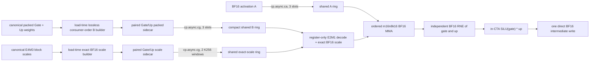

# SM87 NVFP4 large-M global dataflow reset

Date: 2026-07-30  
Production baseline: `c65f938`  
Immediate whole-runner candidates: `fb6a17f`, `50905fd`
Scope: Qwen3.6-27B-NVFP4 on the fixed 16-SM SM87 Orin target

This is a static architecture audit and an implementation contract.  It does
not claim a new GPU timing.  Performance authority remains the OpenAI server
and frozen EvalScope workload with authenticated model weights.  Synthetic
matrices may test exhaustive arithmetic and guards, but cannot retain or
promote a performance change.

## Decision

The current vendored Marlin kernel is a useful correctness and performance
anchor, but it is not the final native large-M skeleton.  Gate/Up and Down both
select `M64xN256xK64`, four stages, 256 threads, and a persistent 16-CTA grid.
The large-M specialization compiles at 255 registers/thread and launches with
166,912 dynamic shared bytes.  It therefore has one CTA/SM residency.  Reducing
only the number of stages cannot satisfy the new hard two-CTA/SM contract:
register pressure already independently excludes the second CTA.

The replacement is a 256-thread `M64xN256xK64` cell with at most 128
registers/thread, zero local memory, and at most 83,968 bytes of total shared
memory/CTA.  Gate and Up are paired inside one physical N256 tile and publish
`SiLU(gate) * up` directly.  Down uses the same operand-feed primitives but a
different grid order and cache selector.  Packed B and scales are transformed
once at model load into consumer order; no BF16 weight image is materialized.

The first immediate candidate did not wait for that replacement.  Commit
`fb6a17f` changed only NVFP4 Marlin activation copies from `cp.async.cg` to
`cp.async.ca`; packed B and scales remained `.cg`, and FP8 Marlin remained
wholly unchanged.  The end-to-end EvalScope direction was negative, so this
cache-policy migration is rejected on the current persistent Marlin skeleton
and reverted before structural work continues.

The first executable paired Gate/Up skeleton in `50905fd` also passed its
compile-time residency gate but failed the real runner decisively.  It is
archived and withdrawn below.  That result corrects one important premise in
the original traffic model: pairing Gate N128 with Up N128 inside physical
N256 does **not** reduce A presentation relative to merged Marlin N256.  Both
still have 136 N work tiles at C512.  The pairing deletes the merged-output
round trip, but it is not by itself a GEMM reuse breakthrough.

### A-only `.ca` whole-runner rejection

The frozen eight-request real-weight run returned 8/8 byte-identical outputs,
but both required performance directions failed:

| metric | native `c92a2ef` | candidate `fb6a17f` | change |
|---|---:|---:|---:|
| prompt throughput | 177.913533 tok/s | 177.717474 tok/s | -0.196059 tok/s |
| mean TTFT | 1167.935631 ms | 1171.043035 ms | +3.107404 ms |
| wall time | 22.376038 s | 22.400724 s | +0.024685 s |
| mean TPOT | 108.587628 ms | 108.585038 ms | -0.002589 ms |

The direction validator exited 3.  The long-prompt buckets are uniformly
negative: candidate-minus-baseline mean TTFT is +2.812546 ms for P129--512,
+3.910353 ms for P513--1024, and +7.153525 ms for P1025+.  This is not neutral
noise that warrants a larger harness.  A-only `.ca` remains valid evidence for
the older independently scheduled custom M64N256 cell, but is not portable to
the current four-stage persistent Marlin scheduler.  No further cache-only
Marlin scan is authorized.

### Direct-canonical paired Gate/Up whole-runner rejection

Commit `50905fd` implemented the first complete large-M admission cell rather
than another parameter scan.  A 256-thread M64xphysical-N256xK64 CTA pairs
Gate N128 with the matching Up N128, uses three asynchronous operand stages,
rounds both branches independently to BF16, evaluates the production SiLU
expression in the owning CTA, and writes only the final N128 intermediate.
The real runner then uses the unchanged Marlin Down projection.  The
candidate consumes authenticated canonical weights and scales directly; it
does not claim that the planned load-time consumer-order sidecars exist.

The final ELF passes the hard resource envelope exactly: 128 registers/thread,
512 static plus 68,608 dynamic shared bytes, zero local/stack bytes, 256
threads, and two active CTAs/SM.  Its SASS contains the intended cache split
(`LDGSTS.E.128` for A and `LDGSTS.E.BYPASS.128` for B/scales).  Nevertheless,
the frozen real-weight EvalScope screen is strongly negative:

| metric | native `c92a2ef` | candidate `50905fd` | change |
|---|---:|---:|---:|
| prompt throughput | 177.913533 tok/s | 170.705966 tok/s | -7.207567 tok/s |
| mean TTFT | 1167.935631 ms | 1281.558598 ms | +113.622967 ms |
| p50 TTFT | 1294.804216 ms | 1477.522311 ms | +182.718095 ms |
| p99 TTFT | 2370.425952 ms | 2726.162066 ms | +355.736114 ms |
| wall time | 22.376038 s | 23.320802 s | +0.944764 s |

The runtime selector accepts only an exact C512 chunk.  Requests of at most
512 prompt tokens therefore retain the baseline path and differ by only
+1.198 to +3.446 ms.  The three 513--1024-token requests each execute one
candidate chunk and regress by +181.319580 ms on average; the 1025-token
request executes two and regresses by +355.736114 ms.  This near-linear
one-/two-chunk slope is direct whole-runner evidence that the admission path
was hit in every eligible layer, not a dormant-switch or dispatch error.

Database integrity, request-manifest matching, completion chunks, metric
recomputation, and benchmark argument comparability all pass.  Generated
outputs are exact for 7/8 requests.  The only divergence is the 564-token
case, where one greedy choice changes after the common prefix.  Thus the
candidate independently fails both the performance direction and the frozen
output-identity gate.

The structural loss is consistent with the executable design, without an NCU
postmortem being needed to decide retention:

- M64xphysical-N256 still produces only 256 branch values per CTA, exactly as
  merged Marlin N256 does.  It therefore presents the same 680 MiB of logical
  A traffic per C512 layer, not half as much.
- The candidate launches 1,088 physical CTAs per layer.  Marlin launches 16
  persistent CTAs and advances the same logical work inside them.  Across 64
  MLP layers the candidate repeats CTA prologue, E4M3 codebook publication,
  and barriers 69,632 times per C512 chunk.
- Canonical row-major B and byte E4M3 scales are selected, copied, swizzled,
  and decoded in the hot loop.  Marlin moves its weight/scale permutation and
  scale preparation to model load and uses a four-stage, high-ILP inner feed.
  Two-CTA residency cannot compensate for retaining those runtime transforms.
- Fusing SiLU saves about 68 MiB of logical merged-intermediate traffic per
  layer, only 4.4% of the corrected Gate/Up presentation.  That bounded saving
  is smaller than the measured feed and scheduler loss.

The rejection is scoped to direct-canonical, per-logical-tile M64N256 pairing.
It does not authorize a cache/stage scan of this kernel.  Any successor must
change the inner feed and physical work scheduling together, and must account
honestly for the fact that N128+N128 pairing preserves rather than halves A
presentation.  Two-CTA residency remains a resource check, not evidence of
throughput by itself.

## Audited current state

The project vendors the same `marlin_template.h` as local vLLM commit
`ccd49f682` before the project-local cache hook.  The local vLLM ModelOpt NVFP4
route also selects generic Marlin; there is no hidden SM87-only large-M NVFP4
kernel to copy.  Triton and newer vLLM FP4 kernels contribute scheduling and
layout ideas, but their native FP4/TMA execution paths target later hardware.

At the checked-in P513 profile, the FE2M1 Marlin family accounts for 128 calls
and 666.4768 ms.  FP8 Marlin contributes about 332 ms.  The separate merged
Gate/Up SiLU kernel accounts for 64 calls and 26.5935 ms.  The FE2M1 symbol
mixes merged Gate/Up and Down, so per-role attribution must use a role-filtered
capture rather than dividing its mean blindly.

Static resource evidence from the production ELF is:

| large-M path | tile | registers/thread | dynamic shared | resident CTA conclusion |
|---|---:|---:|---:|---:|
| current NVFP4 Marlin | M64 N256 K64, stages 4 | 255 | 166,912 B | one CTA/SM |
| retained custom BS512 | M64 N256 K64, stages 3 | 128 | 68,608 B + 512 B static | two CTAs/SM |
| current custom exact-C512 | M128 N256 K128, stages 2 | 247 | 118,784 B + 512 B static | one CTA/SM |
| rejected direct-canonical pair `50905fd` | M64 physical-N256 K64, stages 3 | 128 | 68,608 B + 512 B static | two CTAs/SM |
| successor resource ceiling | accumulator product at most 16K, 256 threads | <=128 | <=83,968 B total | at least two CTAs/SM |

The target shared allocation is not speculative arithmetic: it reuses the
already compiled BS512 envelope.  Three padded `M64xK64` A slots consume
27,648 bytes, three packed `N256xK64/2` B slots consume 24,576 bytes, and two
exact-BF16 `N256xK256/16` scale slots consume 16,384 bytes.

### Why M128xN256 cannot meet the hard residency contract

SM87 has 65,536 32-bit registers per SM.  Two 256-thread CTAs cap a kernel at
128 registers/thread before allocation granularity.  An MxN output tile alone
requires `M*N/threads` FP32 accumulator registers per thread:

| tile | accumulator registers/thread | remaining registers at 2 CTA/SM |
|---|---:|---:|
| M64xN256 | 64 | 64 |
| M128xN128 | 64 | 64 |
| M128xN256 | 128 | 0 |
| M64xN512 | 128 | 0 |

M128xN256 consequently cannot carry addresses, A/B fragments, decode state,
or an epilogue while preserving two 256-thread CTAs.  Spill, split-K, partial-C
traffic, or recomputation would only disguise the violation.  The existing
247-register binary confirms the bound.  Under the hard residency rule the
larger-M production cell is evidence about reuse, not a viable base skeleton.

## Rejected structures that must not be rediscovered

- B or scale `.ca`: measured negative.  Only A is eligible for L1 cache-all.
- Four-stage buffering without a new publication unit: measured negative.
- Monolithic M64xN512 and the ordinary 512-thread shared-A Gate/Up cell: both
  lost independent phase progress; their synchronization structures are
  rejected.
- M128xN256 under the two-CTA contract: physically impossible as shown above.
- Shared pair/product lookup tables, including conflict-free lane-striped
  replication: fewer instructions did not repay LSU/MIO pressure.
- Canonical scale U32 hoisting: fewer shared transactions but more extraction
  instructions and registers; real P513 was non-positive.
- Blind shared leading-dimension changes, merged K128 B64 rows, runtime K64
  half loops, and raw extra pipeline depth: all have pinned negative records.
- Persistent scheduling without a new inner feed: the old Down cell reached
  roughly 0.51x and did not reduce K-inner presentation.
- Split-K: changes the frozen accumulation/reduction order and adds FP32
  partial-C traffic.
- A BF16 weight sidecar: this is the external bridge mechanism and is never
  eligible for production.  A lossless packed-weight permutation and an exact
  decoded-scale sidecar are different and remain self-hosted.

Positive mechanisms retained in the replacement are A-only `.ca` for the
large-N Gate family, B/scale `.cg`, three raw operand stages, compact 32-byte
B rows, K256/K512 structured scale windows, direct register-to-MMA B feed,
table-free E2M1 decode, coalesced BF16 stores, and role-specific one-dimensional
CTA traversal.

## Target dataflow



There is no cross-CTA reduction, lock, global partial C, or post-GEMM merged
Gate/Up buffer.  Every CTA owns its full K traversal and final output tile.
The K16 accumulation order remains ascending and unchanged.  The fused
epilogue first rounds Gate and Up independently to BF16, decodes those exact
bits, evaluates the same SiLU expression as production, and rounds the final
product to BF16.  This ordering is required for bitwise equality.

### Lossless sidecar layouts

One Gate/Up CTA owns M64 and 128 logical intermediate columns.  Its physical
N256 dimension contains 128 Gate plus 128 corresponding Up columns.  Within
each warp's physical N32 slice, rows 0..15 are Gate and rows 16..31 are the
matching Up columns.  This keeps both independently accumulated BF16 values in
one warp for the fused epilogue without increasing the accumulator product.

The packed-weight sidecar is:

```text
Gate/Up B: [logical_N128_tile][K64_stage][512 contiguous uint4]
Down B:    [N256_tile][K64_stage][512 contiguous uint4]
```

Each K64 stage is exactly 8,192 bytes.  Its 512 aligned vectors are already in
the compact half-swizzled shared consumer order, so 256 threads issue two
contiguous `.cg` copies each.  This replaces the existing Marlin packed-weight
sidecar byte-for-byte; it is not an additional persistent weight copy.

The scale sidecar is:

```text
Gate/Up S: [logical_N128_tile][K256_window][physical_N256][16 BF16]
Down S:    [N256_tile][K256_window][N256][16 BF16]
```

One scale window is 8,192 bytes.  Load-time conversion must be exact for all
E4M3FN encodings, including signed zero, subnormals, and NaNs; it is not the
lossy performance interpretation of a generic format.  This doubles only the
scale payload and removes the data-indexed 256-entry shared codebook from the
hot loop.  Across all 64 MLP layers it adds 1.0 GiB relative to the present
one-byte Marlin scale sidecars.  The arena audit must approve that explicit
cost before production routing.

## Shape-specific schedules

| property | paired Gate/Up | Down |
|---|---|---|
| logical operation | two `[M,5120] x [17408,5120]^T` branches | `[M,17408] x [5120,17408]^T` |
| CTA tile | M64 x physical N256 x K64 | M64 x N256 x K64 |
| C512 grid | 8 x 136 = 1,088 CTAs | 8 x 20 = 160 CTAs |
| K64 stages | 80 | 272 |
| operand pipeline | 3 A/B slots | 3 A/B slots |
| scale pipeline | 2 K256 windows | 2 K256 windows |
| CTA order | strict A-stationary: all N pairs for one M tile | B-stationary: all M tiles for one N panel |
| A cache | `.ca` | role selector starts from `.cg`; `.ca` has no authority until real-path evidence |
| B/scale cache | `.cg` | `.cg` |
| output | direct fused `[M,17408]` | direct `[M,5120]` |
| resource gate | <=128 regs, 68,608 B shared, 2 CTA/SM | same |

The immediate generic-Marlin candidate necessarily applies A `.ca` to both
roles because Gate/Up and Down instantiate the same vendored body.  Its
whole-runner result decides whether that broad interim change survives.  The
new skeleton must expose the role selector shown above; a Gate result never
chooses the Down cache policy or pipeline.

### Corrected logical traffic at C512

These are topology presentations, not EMC measurements:

| path | A | packed B | scales | intermediate/output traffic | total |
|---|---:|---:|---:|---:|---:|
| current merged M64 Gate+Up + separate SiLU | 680 MiB | 680 MiB | 85 MiB | 34 MiB write + 34 MiB read + 17 MiB write | 1,530 MiB |
| direct-canonical paired N128+N128 (`50905fd`) | 680 MiB | 680 MiB | 85 MiB | 17 MiB write | 1,462 MiB |
| paired N128+N128 with exact BF16 scales | 680 MiB | 680 MiB | 170 MiB | 17 MiB write | 1,547 MiB |
| current M64 Down with byte scales | 340 MiB | 340 MiB | 42.5 MiB | 5 MiB | 727.5 MiB |
| target M64 Down with exact BF16 scales | 340 MiB | 340 MiB | 85 MiB | 5 MiB | 770 MiB |

The original 340-MiB A estimate for paired Gate/Up was wrong.  Physical N256
contains only 128 columns from each branch, so 136 work tiles remain and A is
still presented 136 times.  The direct-canonical cell removes about 4.4% of
logical presentation by deleting the merged output/read and final standalone
write.  An exact-BF16 scale sidecar increases total logical bytes unless its
cheaper decode repays the extra traffic.  Down deliberately pays 42.5 MiB more
logical scale traffic to remove indexed shared scale decode; its much longer K
traversal and smaller grid make this a separate real-path decision rather than
a Gate inference.

## Explicit modification set

1. Preserve `fb6a17f` only as the reproducible rejected current-Marlin
   candidate.  Its frozen eight-request EvalScope direction is negative; the
   source is reverted and no microbenchmark or cache-policy follow-up is run.
   A role-specific cache selector belongs only to the replacement cell.
2. `50905fd` proves that the M64 physical-N256 resource envelope is attainable
   but not competitive when each logical tile is a physical CTA and canonical
   transforms remain in the hot loop.  Preserve it only in history.  A
   successor must change consumer layout plus physical scheduling as one
   architecture; reject another cache, stage, or launch-order scan on this
   skeleton.  Continue to fail closed above 128 registers, on local/stack
   bytes, or below two active CTAs/SM, while treating that gate as necessary
   rather than sufficient.
3. Add load-time builders for the layouts above.  Builders must be outside all
   timings, preserve every packed E2M1 nibble, exhaustively preserve all scale
   codes, and report exact bytes to the request/model memory audit.
4. Add distinct `prefill_large_m_weight`, `prefill_large_m_scale`, and
   readiness descriptors to `NvFp4LinearWeight`.  Do not overload canonical
   Decode pointers or silently retain both the old and new Prefill sidecars.
5. Route paired Gate/Up first behind one explicit admission flag, keeping the
   existing Down route.  Its first performance question is the complete real
   server path, not an isolated Gate kernel.  If positive, run bitwise eager
   and Graph replay, guards, aliases, immutable-input tests, resource/SASS
   gates, then repeated native-baseline timing and matched real-weight NCU.
6. Route the independently selected Down specialization only after its own
   complete real-server direction result.  Compare `.cg` and `.ca` only as
   complete Down configurations if the whole-runner profile justifies it; B
   and scale remain `.cg` in every case.
7. At accumulated milestones, compare the complete self-hosted runner with
   the frozen vLLM result.  cuBLASLt remains a diagnostic reference only and
   has no production descriptor, dispatch, fallback, or promotion vote.

## Evaluation order

The gates answer different questions and must remain in this order:

1. **Real direction:** frozen EvalScope performance command, real server, real
   weights, short fixed workload.  Candidate versus current native baseline.
2. **Validity after a positive direction:** bitwise arithmetic and fused
   epilogue, guards, Graph replay, memory accounting, and resource/SASS proof.
3. **Stability and attribution:** mirrored independent-process native timing,
   then NSys/NCU on the same real payload.  A failed but informative direction
   may still receive one profiler capture for architectural attribution.
4. **Promotion:** longer output, full Release suite, Decode P1/P2 regression,
   and the external whole-runner vLLM parity comparison.

An experiment is retained when it is stably better than the current native
experimental baseline; it does not need to beat the external reference by
itself.  The external reference is consulted after cumulative progress, while
production always remains self-hosted.
